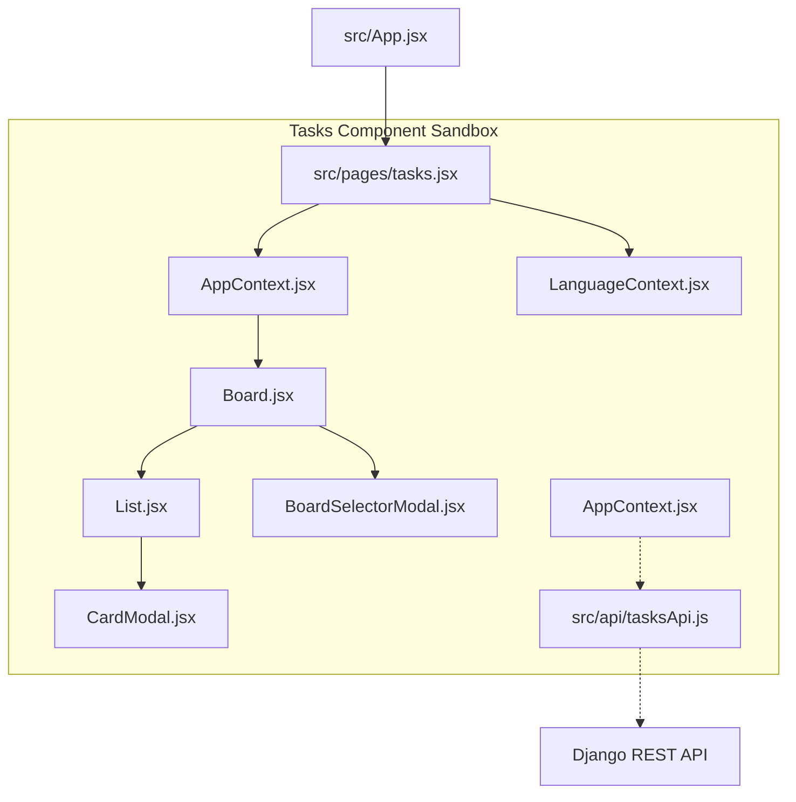

# Architecture: Trello Clone Integration

This document outlines the architectural structure of the advanced tasks board component integrated into smartTalim.



## 1. Directory Structure

The tasks system is isolated inside its own folder to ensure modularity and clean separation of concerns:

- `src/pages/tasks.jsx`: The application router/page entrypoint. Wraps the tasks component tree in context providers and sets up the root sandbox class. Always renders `Board.jsx` directly.
- `src/components/tasks/`: Contains all task board logic, components, translations, and styles.
  - `components/`: Modular child components:
    - [CardModal.jsx](file:///home/lite/Documents/smartTalim/src/components/tasks/components/CardModal.jsx): Handles card details, checklists, attachments, comments, and members.
    - [List.jsx](file:///home/lite/Documents/smartTalim/src/components/tasks/components/List.jsx): Renders task lists/columns and supports drag-and-drop.
    - [BoardSelectorModal.jsx](file:///home/lite/Documents/smartTalim/src/components/tasks/components/BoardSelectorModal.jsx): Modal for renaming, switching, deleting boards and changing backgrounds. Triggered from the board header grid button.
    - Modals (`SettingsModal.jsx`, `MembersModal.jsx`, `BillingModal.jsx`, etc.): Settings and auxiliary configuration screens.
  - `pages/`: Primary page views:
    - [Board.jsx](file:///home/lite/Documents/smartTalim/src/components/tasks/pages/Board.jsx): The active Trello board view showing columns, cards, header tools, and custom background options. Includes a blank state UI when no boards exist.
  - `context/`: Root state management:
    - [AppContext.jsx](file:///home/lite/Documents/smartTalim/src/components/tasks/context/AppContext.jsx): Holds application-wide states (current board, list list, cards details) and communicates with the backend API.
  - `i18n/`: Localized text:
    - `LanguageContext.jsx` & `translations.js`: Dedicated, lightweight translations for over 200 task-specific terminology tags, independent of global translation files.

---

## 2. State & Data Synchronization Flow

1. **Initial Load**:
   - The app reads standard config templates, boards list, and current user details from the API.
2. **State Updates**:
   - Actions (creating a board, moving a card, editing checklist items) are handled via local state changes combined with asynchronous API requests.
3. **Lazy-Loading Card Sub-Relations**:
   - To optimize server and network performance, heavy relations like **Checklists**, **Attachments**, and **Comments** are not retrieved during initial board loading.
   - Opening the `CardModal` triggers a lazy load request to pull specific items for that card, ensuring responsive rendering and minimal API payload overhead.

---

## 3. Styling & Theme Isolation (Light & Dark Modes)

To prevent stylesheet leakage and visual conflicts, a sandbox architecture is used:

### A. Root Sandboxing
The entire tasks board is enclosed within a single CSS class wrapper `.trello-app-container`.
All task CSS classes are scoped to this selector, ensuring Trello styles do not bleed onto other smartTalim pages (e.g., students registry, dashboard, settings).

### B. CSS Variables System
Instead of hardcoding colors, the application uses CSS variables defined in [App.css](file:///home/lite/Documents/smartTalim/src/components/tasks/App.css):

```css
.trello-app-container {
  /* Light Mode Variables */
  --tasks-bg: #f6f8fa;
  --tasks-text-primary: #172b4d;
  --tasks-card-bg: #ffffff;
  --tasks-input-bg: #ffffff;
  /* ... */
}

[data-theme="dark"] .trello-app-container {
  /* Dark Mode Overrides */
  --tasks-bg: #1d2125;
  --tasks-text-primary: #e8edf2;
  --tasks-card-bg: #22272b;
  --tasks-input-bg: #22272b;
  /* ... */
}
```

### C. Global Reset Exclusions
To keep the layout pixel-perfect and prevent conflicts with global stylesheet overrides (like global card margins, default input fields, or button heights), `src/index.css` employs `:not()` exceptions:

```css
/* Avoid forcing global button heights inside the tasks sandbox */
button:not(.trello-app-container *) {
  height: 40px !important;
}
input:not(.trello-app-container *) {
  height: 40px;
}
```
This isolates the native design aesthetics of the tasks board, keeping layouts perfectly proportioned and preventing overlapping text or form elements.

### D. Stacking Context & z-index Resolution
To support floating popovers and dropdown menus (such as card actions, list selectors, cover settings, or date selectors) without rendering underneath sibling components in the modal body, strict z-index hierarchies are maintained:
- The `.task-card-modal-header` is configured with `zIndex: 10050` to ensure that any dropdown triggered from the top action bar floats above the content body.
- Sibling action controls in the card body reside within `.relative` wrapper nodes configured with `z-index: 10020`.
- Floating dropdowns themselves utilize a higher z-index (e.g., `10030` or `10041`), allowing them to render neatly on top of adjacent columns, checkboxes, and buttons.

### E. Task History Endpoint & Context Isolation
To enable full auditing and collaboration features on task items, the system integrates a nested task history endpoint:
- **Endpoint**: `/api/v1/tasks/items/<vazifa_id>/history/`
- **Method**: `GET`
- **Headers**:
  - `Authorization: Bearer <accessToken>` (handled automatically by `axiosInstance.js`)
  - `x-org-id: <organizationId>` (manually injected via `localStorage.getItem("org_id")` to enforce organization-level context isolation)
- **Data Flow**:
  1. Triggered inside `fetchCardDetails()` in `AppContext.jsx` when opening a card.
  2. Map results into state data as `card.history`.
  3. Formatted and merged with comments in `getActivities()` inside `CardModal.jsx`.


