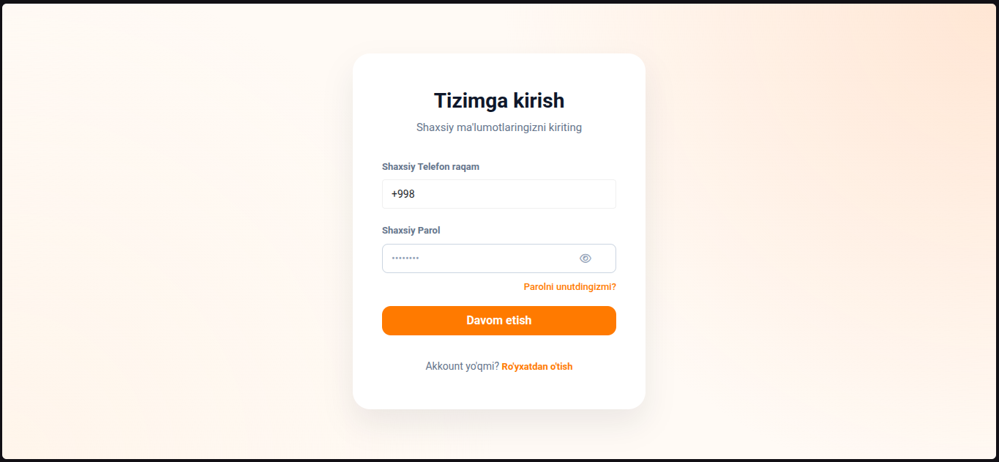
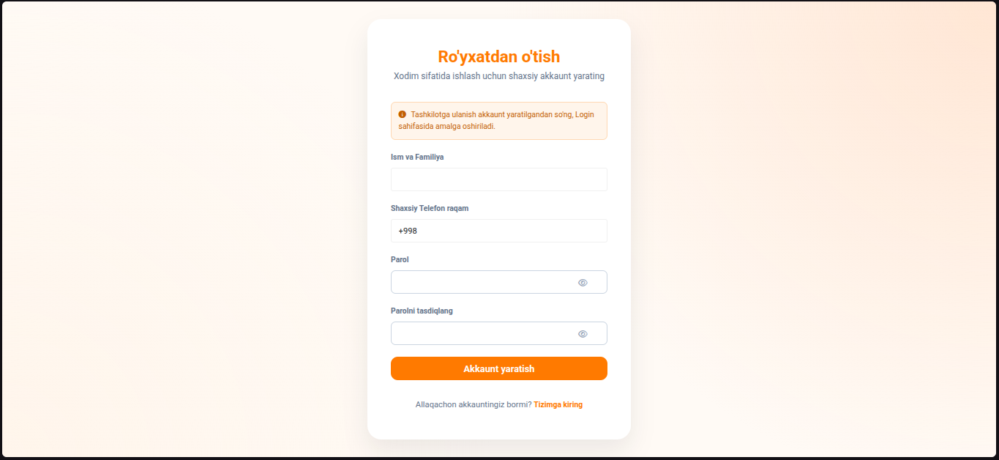
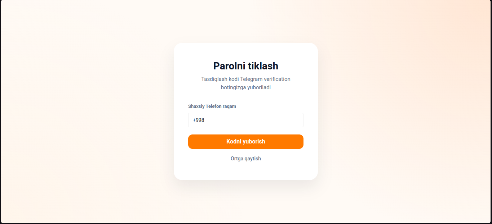
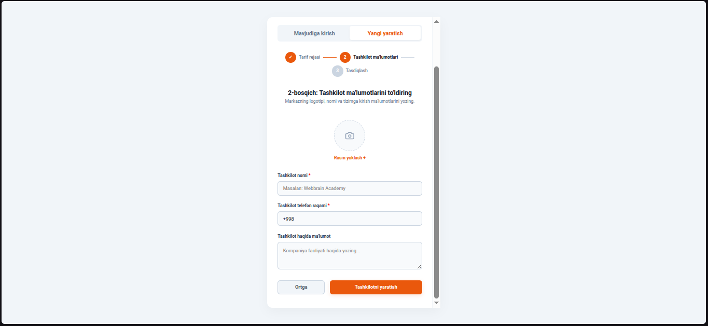
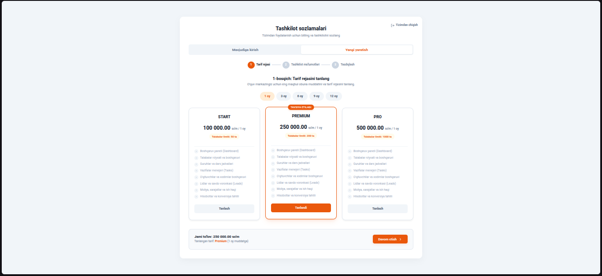
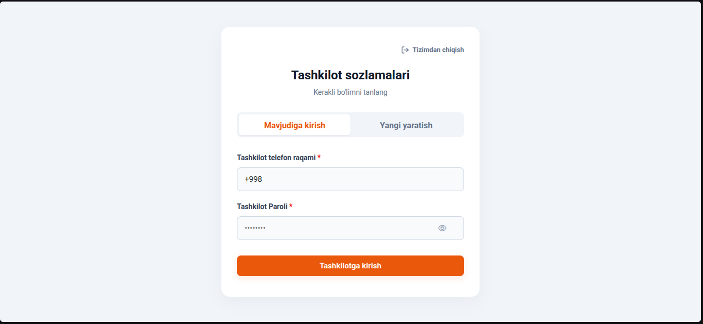
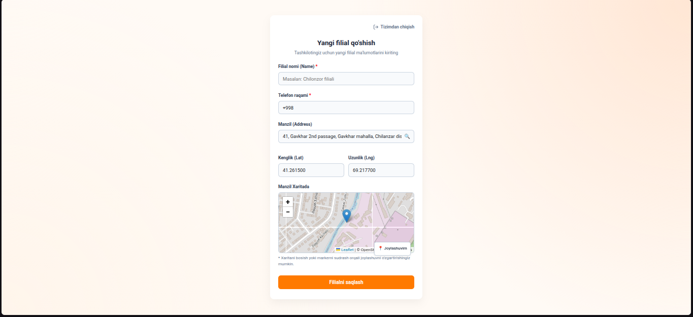
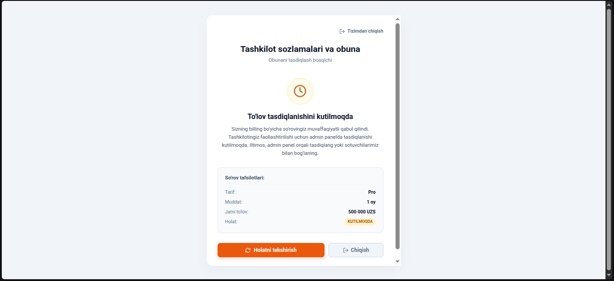

# Avtorizatsiya va Tizim Sozlash (Tizimga kirish va birinchi sozlamalar)

Ushbu bo'limda tizimga kirish, yangi akkaunt yaratish, parolni tiklash hamda birinchi marta kirganda tashkilot va filial yaratish, obuna (billing) tizimi sozlamalari bosqichma-bosqich foydalanish ko'rsatmalari bilan yoritilgan.

---

## 1. Avtorizatsiya (Kirish, Ro'yxatdan o'tish va Tiklash)

### A. Tizimga Kirish (Login)
Tizimga kirish oynasi smartTalim CRM foydalanuvchilarini autentifikatsiya qilish uchun xizmat qiladi. Tizimga faqat faol xodimlar, administratorlar, o'qituvchilar va talabalar kira oladi.

#### Bosqichma-bosqich tizimga kirish yo'riqnomasi:
1. **Telefon raqamingizni kiriting**: `Telefon raqami` maydoniga tizimda ro'yxatdan o'tgan telefon raqamingizni kiriting (masalan: `+998 90 123 45 67`). Raqam xalqaro formatda kiritilishi shart.
2. **Parolni kiriting**: `Parol` maydoniga akkauntingiz maxfiy kalitini yozing. Oynaning o'ng burchagidagi "ko'z" (eye) belgisi ustiga bosib, yozayotgan parolingiz to'g'riligini tekshirib olishingiz mumkin.
3. **Sessiyani saqlash**: Agar shaxsiy kompyuteringizdan kirayotgan bo'lsangiz, `Eslab qolish` (Remember me) checkboxini belgilang. Bu tizim brauzerni yopganingizdan keyin ham sizni avtomatik tizimda saqlab qolishini ta'minlaydi.
4. **Kirishni tasdiqlash**: `Kirish` tugmasini bosing. Agar ma'lumotlar to'g'ri bo'lsa, tizim sizni avtomatik ravishda `/dashboard` sahifasiga yo'naltiradi.

#### Muammolarni bartaraf etish (Troubleshooting):
* **"Telefon raqami yoki parol noto'g'ri" xatoligi**: Raqamda ortiqcha harf yoki bo'shliq yo'qligini, parolni yozishda bosh harflarga (Caps Lock) e'tibor berganingizni tekshiring.
* **Akkauntingiz yo'q bo'lsa**: Pastki qismdagi `Ro'yxatdan o'tish` havolasini bosing.

---

### B. Ro'yxatdan o'tish (Register)
O'quv markazining bosh rahbari (Owner) uchun tizimda yangi tashkilot profilini ochish oynasi.

#### Yangi akkaunt yaratish bosqichlari:
1. **Ism va Familiyangizni kiriting**: `Ism` va `Familiya` maydonlariga o'z ma'lumotlaringizni to'liq kiriting. Bu ma'lumotlar keyinchalik "Tashkilot rahbari" sifatida hisobotlarda va billing cheklarida ko'rinadi.
2. **Asosiy telefon raqamini kiriting**: Tizimga kirish uchun login bo'lib xizmat qiladigan shaxsiy telefon raqamingizni kiriting.
3. **Parol o'rnatish**: `Parol` va `Parolni tasdiqlash` maydonlariga bir xil maxfiy kalit yozing. Parol kamida 6 ta belgidan iborat bo'lishi va xavfsizlik uchun unda harflar hamda raqamlar bo'lishi tavsiya etiladi.
4. **Ro'yxatdan o'tishni yakunlash**: `Ro'yxatdan o'tish` tugmasini bosing. Tizim sizga akkaunt yaratadi va avtomatik ravishda birinchi tashkilotni sozlash sahifasiga o'tkazadi.

---

### C. Parolni tiklash (Lost Password)
Parolini unutib qo'ygan foydalanuvchilar akkauntga kirish huquqini qaytarish uchun ushbu oynadan foydalanadilar.

#### Parolni qayta tiklash bosqichlari:
1. Kirish oynasidagi `Parolni unutdingizmi?` havolasini bosing.
2. Ochilgan oynada ro'yxatdan o'tgan telefon raqamingizni kiriting.
3. Telefoningizga kelgan maxsus tasdiqlash kodini yozing va yangi parol o'rnating.

---

## 2. Tashkilot va Filial Yaratish (Setup Flow)

Akkaunt yaratilgandan so'ng, tizim to'g'ri ishlashi uchun tashkilot va kamida bitta filial haqidagi ma'lumotlarni kiritish shart.

### A. Tashkilot yaratish sahifasi (/x-portal-sys/setup/org)
Yangi o'quv markazini ro'yxatdan o'tkazish oynasi.

#### Sozlash yo'riqnomasi:
1. **Tashkilot nomi**: `Tashkilot nomi` maydoniga o'quv markazingiz rasmiy brend nomini kiriting (masalan: *Smart Academy*).
2. **Rasmiy aloqa telefoni**: Mijozlar markaz bilan bog'lanishi uchun tashkilotning umumiy raqamini yozing.
3. **Logotip yuklash**: `Logotip` tugmasini bosib, markazingiz logotipini (PNG yoki JPG formatida, o'lchami tavsiya etiladi: 500x500px) yuklang. Bu rasm tizim burchagida va cheklarda chiroyli chiqishi uchun sifatli bo'lishi lozim.
4. **Tavsif**: O'quv markazi faoliyati haqida qisqacha ma'lumot yozing.
5. **Saqlash**: Ma'lumotlarni tekshirib, `Tashkilotni yaratish` tugmasini bosing.

---

### B. Tashkilot ma'lumotlari oynasi (Organization Details)
Tashkilot muvaffaqiyatli yaratilgandan keyin uning holati va billing tafsilotlarini ko'rish oynasi.

* Bu sahifada tashkilotning to'lov holati, joriy obuna turi va uning muddati haqida batafsil ma'lumot beriladi.

---

### C. Filial yaratish sahifasi (/x-portal-sys/setup/org/branch)
Har bir o'quv markazi guruhlar va xonalarni to'g'ri taqsimlashi uchun kamida bitta filialga ega bo'lishi shart.

#### Filial qo'shish yo'riqnomasi:
1. **Filial nomi**: Filial qayerda joylashganini anglatuvchi nom yozing (masalan: *Chilonzor filiali* yoki *Bosh ofis*).
2. **Manzil**: Filialning jismoniy manzilini batafsil yozing. Bu ma'lumot talabalar ro'yxatdan o'tganda yoki dars jadvallarida foydalaniladi.
3. **Aloqa raqami**: Aynan shu filial ma'muriyatining telefon raqamini kiriting.
4. **Saqlash**: `Filialni yaratish` tugmasini bosing. Shundan so'ng tizim sizni to'liq ishchi asboblar paneliga (`/dashboard`) yo'naltiradi.

---

### D. Obuna talab etilishi (Subscription Pending)
Tizim SaaS (xizmat sifatida dasturiy ta'minot) modeli asosida ishlaganligi sababli, to'lov rejasi (obuna) faol bo'lmagan foydalanuvchilarning tizimga kirishi bloklanadi.

#### Nima qilish kerak?
* Agar ekraningizda ushbu oyna paydo bo'lsa, demak tashkilotingiz uchun sinov muddati (trial) tugagan yoki oylik obuna to'lovi muddati kelgan.
* Davom ettirish uchun `Obunani yangilash` tugmasini bosib, billing sozlamalaridan tarifni faollashtirishingiz yoki tizim administratoriga (smartTalim support jamoasiga) murojaat qilishingiz lozim.
