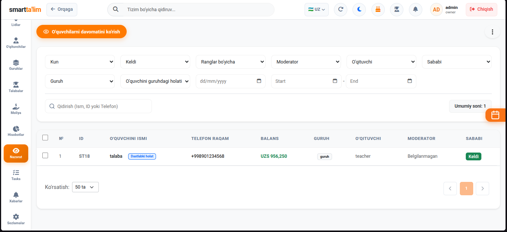
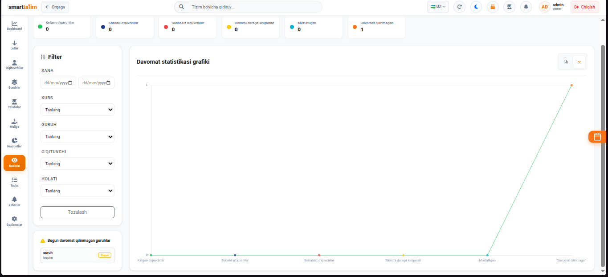
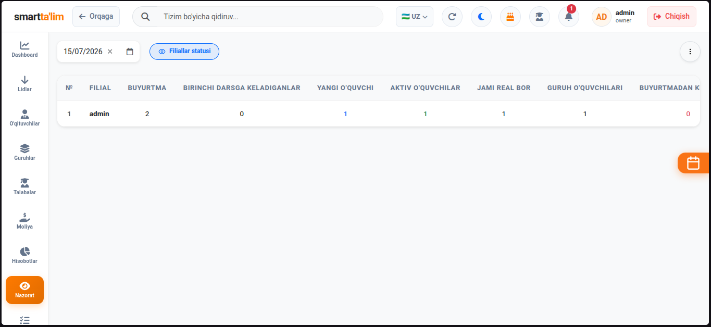

# Nazorat (Control) - Monitoring va Intizom

**Nazorat** bo'limi o'quv markazining barcha filiallari, guruhlari, darslari va o'quvchilari ustidan umumiy monitoring olib borish uchun xizmat qiladi. Bu bo'lim asosan o'quv markazidagi ijro intizomini nazorat qilish va davomat sifatini yaxshilash uchun qo'llaniladi.

---

## 1. Barcha Davomatlar (All Attendances)

Tizimdagi barcha filial va guruhlarning kunlik davomatlarini yagona jadvalda ko'rish va boshqarish oynasi.

#### Boshqaruv va qidiruv yo'riqnomasi:
1. **Tezkor filtrlash (Filters)**:
   * **Sana filtri** — Ma'lum bir kun uchun (masalan: *bugungi darslar*) davomat holatini tekshirish.
   * **Guruh va O'qituvchi filtrlari** — Istalgan guruh yoki o'qituvchining darsdagi davomatini saralash.
2. **Davomat holatini ko'rish**: Jadvalda dars sanasi, guruh nomi, dars o'tgan pedagog, dars soati, xona va umumiy kelish koeffitsiyenti (foizda) ko'rsatiladi (masalan: *92% talaba qatnashdi*).
3. **Davomatni tahrirlash (Edit Attendance)**:
   * Agar administrator yoki o'qituvchi davomat olishda xatoga yo'l qo'ygan bo'lsa (masalan: kelgan talabani adashib kelmadi deb belgilagan bo'lsa), joriy dars qatoridagi "Tuzatish" tugmasini bosib, davomatni qaytadan to'g'rilab saqlab qo'yish mumkin.

---

## 2. Davomat Statistikasi (Attendance Stats)

O'quv markazidagi davomat ko'rsatkichlarini grafik va tahliliy diagrammalar orqali tahlil qilish paneli.

#### Grafiklar tahlili:
* **Haftalik va Oylik kelish dinamikasi (Attendance Trend)** — Darslarga talabalarning qatnashish ko'rsatkichi oylar kesimida qanday o'zgarayotgani. Agar kelish foizi tushib ketsa, demak ta'lim sifatini tekshirish lozim bo'ladi.
* **Qoldirish sabablari tahlili (Absence Reasons)** — Talabalar dars qoldirganda kiritilgan sabablar doiraviy diagrammada aks etadi. Bu orqali talabalarning dars qoldirishiga eng ko'p sabab bo'layotgan omilni (masalan: *kasallik*, *o'qishdagi imtihonlar*, *sababsiz*) aniqlab, chora ko'rish mumkin.

---

## 3. Filiallar Nazorati (Branch Control)

Ko'p filialli o'quv markazlari uchun barcha filiallar faoliyatini bir vaqtda monitoring qilish va solishtirish oynasi.

#### Solishtirish va tahlil qilish ko'rsatkichlari:
1. **Talabalar soni** — Har bir filialdagi faol, yangi, muzlatilgan va ketgan talabalar umumiy balansi.
2. **Moliyaviy qoldiqlar** — Filiallardagi jami kassalar yig'indisi. Qaysi filial eng ko'p kirim qilayotgani va qaysi filialda xarajatlar yuqoriligi.
3. **Qarzdorlik holati** — Har bir filial bo'yicha talabalarning jami qarzdorlik summasi. Bu ko'rsatkich orqali qaysi filial administratorlari qarzdorlar bilan yomon ishlayotganini aniqlash mumkin.
4. **Davomat intizomi** — Filiallardagi o'quvchilarning umumiy dars qatnashish foizlari solishtirmasi.
