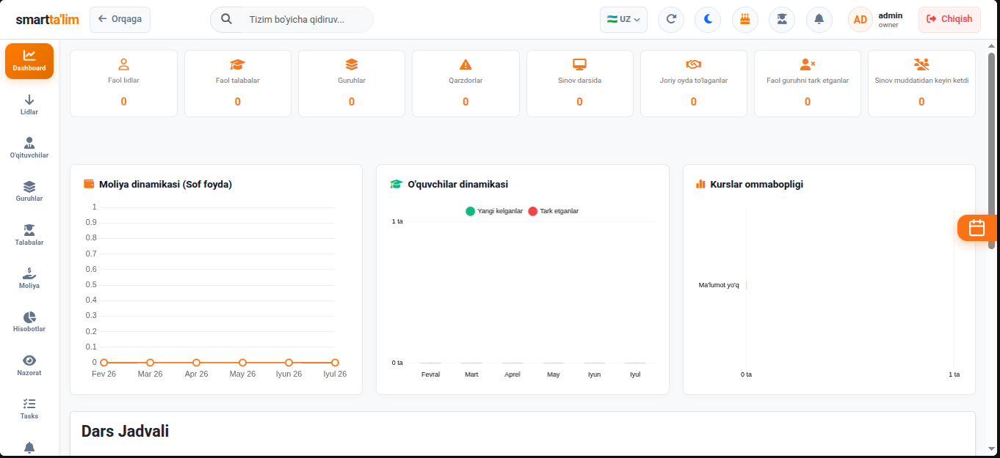
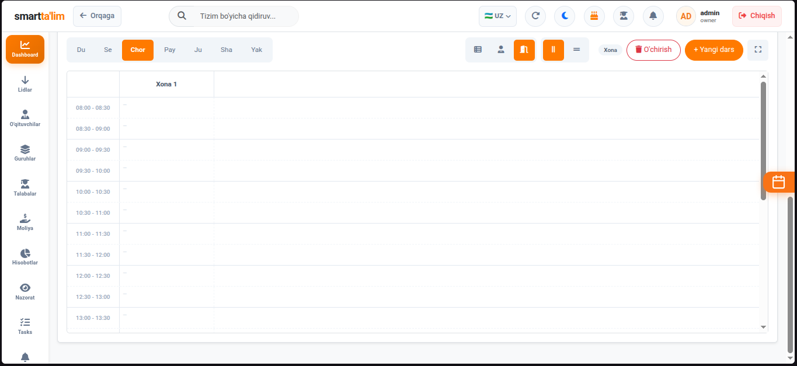

# Bosh Sahifa (Dashboard) - Umumiy Panel

**Dashboard** — bu tizimga kirganda foydalanuvchi ko'radigan birinchi tahliliy ish stolidir. Bu yerda o'quv markazining real vaqtdagi umumiy ko'rsatkichlari, moliyaviy o'sish diagrammalari, kunlik dars jadvallari va kutilayotgan darslar tahlili jamlangan.

---

## 1. Rahbar va Administrator Dashboardi

Tashkilot egasi (Owner) yoki Administrator rolidagi foydalanuvchilar markazning moliyaviy va o'quv ko'rsatkichlarini to'liq nazorat qilish huquqiga ega.

### A. Statistika bloklari (Top Widgets) va ularning hisoblanish qoidalari:
Dashboard tepasida joylashgan 7 ta karta real vaqt rejimida yangilanib turadi (har 30 soniyada ma'lumotlar avtomatik yangilanadi):

1. **Faol o'quvchilar (Active Students)**:
   * **Nima ko'rsatadi**: Hozirda faol guruhlarda o'qiyotgan talabalarning jami dars a'zoliklari (enrollments) soni.
   * **Qanday hisoblanadi**: Tizimdagi faol statusga ega bo'lgan va kamida bitta faol guruhga biriktirilgan o'quvchilarning umumiy guruh a'zoliklari yig'indisi.
2. **Qarzdorlar (Debtors)**:
   * **Nima ko'rsatadi**: O'quv markazidan qarzi bor talabalar soni.
   * **Qanday hisoblanadi**: Balansi `0` dan past (`< 0 UZS`) bo'lgan barcha faol talabalarning umumiy soni.
3. **Sinov darsida (Trial)**:
   * **Nima ko'rsatadi**: Markazda hali to'liq talabaga aylanmagan, sinov (trial) darslarida qatnashayotganlar soni.
   * **Qanday hisoblanadi**: Guruh nomida "sinov" yoki "trial" so'zi bo'lgan yoki statusi "Sinov darsida" bo'lgan talabalarning guruhlar soni.
4. **Joriy oydagi to'lovlar (Paid)**:
   * **Nima ko'rsatadi**: Joriy oy davomida qilingan to'lovlar soni.
   * **Qanday hisoblanadi**: Joriy yil va joriy oyga to'g'ri keluvchi barcha kirim tranzaksiyalarining umumiy soni.
5. **Faol guruhdan ketganlar (Left Active)**:
   * **Nima ko'rsatadi**: Joriy oyda o'qishni to'xtatgan faol talabalar soni.
   * **Qanday hisoblanadi**: `studentLeaves` endpointidan olingan ma'lumotlar asosida, joriy oyda guruhdan chiqib ketgan va guruh nomi sinov bo'lmagan talabalar soni.
6. **Sinovdan ketganlar (Left Trial)**:
   * **Nima ko'rsatadi**: Sinov darsiga kelib, keyinchalik o'qishni davom ettirmay markazni tark etganlar soni.
   * **Qanday hisoblanadi**: Sinov guruhlaridan joriy oyda o'chirilgan yoki chiqib ketgan o'quvchilar soni.
7. **Jami guruhlar soni (Groups Count)**:
   * Filialdagi jami faol va yangi ochilayotgan guruhlar soni.

---

### B. Interaktiv tugmalar va Tafsilotlar jadvallari:
Ushbu kartalarning har biri interaktivdir. Kartalarning birini bosganda, sahifaning pastki qismida shu bo'limga oid batafsil jadval (Expanded List) ochiladi:

* **Qarzdorlar kartasi bosilganda**: Pastda talaba nomi, telefon raqami, aniq qarzdorlik summasi va u o'qiydigan guruhlar ro'yxati ko'rsatiladi. Bu yerdan turib ularga SMS jo'natish yoki to'lov qabul qilish sahifasiga tezkor o'tish mumkin.
* **To'lovlar kartasi bosilganda**: Joriy oyda to'lov qilgan o'quvchilar ro'yxati, to'lov summalari va sanalari jadvali ochiladi.
* **Ketganlar kartasi bosilganda**: Markazdan ketgan o'quvchilar ro'yxati, ularning ketish sabablari (masalan: *vaqt to'g'ri kelmadi*, *narx qimmat*) va arxivlagan xodim ismi ko'rinadi.

---

### C. Analitik Grafiklar va Diagrammalar:
* **Revenue Chart (Daromad grafigi)**: Kassalarga tushgan jami mablag'ning oylik dinamikasi (Nivo/Chart.js chiziqli grafigi).
* **Student Growth Chart (O'quvchilar o'sishi)**: Markazga kelgan yangi o'quvchilar (yashil ustun) va ketgan o'quvchilar (qizil ustun) balansi.
* **Course Popularity (Kurslar ommabopligi)**: Qaysi kursga eng ko'p talaba yozilganini ko'rsatuvchi doiraviy (Pie) diagramma.

---

## 2. Haftalik dars jadvali (Timetable)

Sahifaning pastki qismida haftalik dars jadvallarini xonalar kesimida ko'rsatuvchi interaktiv panel joylashgan.

#### Dars jadvalidan foydalanish yo'riqnomasi:
1. **Dars vaqtini kuzatish**: Jadvalning chap tomonida dars vaqtlari (soatlari), tepa qismida esa dars xonalari ko'rsatiladi.
2. **Dars bloklari**: Rangli bloklar dars borligini ko'rsatadi. Blok ichida guruh nomi, dars o'tadigan o'qituvchining ismi yozilgan bo'ladi.
3. **Filtrlash**: Jadval tepasidagi filtrlardan foydalanib, darslarni *O'qituvchilar* yoki *Xonalar* bo'yicha saralab ko'rishingiz mumkin.
4. **Bo'sh xonani aniqlash**: Jadval orqali ma'lum bir soatda qaysi xonalar bo'sh ekanligini osongina aniqlab, yangi guruhlarni joylashtirish mumkin.

---

## 3. Rolga asoslangan cheklovlar (Role-based views)

Tizimga kirgan foydalanuvchining lavozimiga qarab Dashboard interfeysi o'zgaradi:

### O'qituvchilar uchun:
O'qituvchi kirganda moliyaviy hisobotlar va umumiy markaz statistikasi yashiriladi. U faqat quyidagilarni ko'radi:
* O'ziga biriktirilgan faol guruhlar ro'yxati va ulardagi o'quvchilar soni.
* O'zi uchun hisoblangan joriy oydagi ish haqi summasi.
* Faqat o'z darslari aks etgan shaxsiy dars jadvali.

### Talabalar uchun:
Talaba kirganda faqat shaxsiy sahifa ochiladi:
* Uning shaxsiy balansi (qarzi bor-yo'qligi).
* Rag'batlantiruvchi coinlari qoldig'i.
* Qoldirilgan darslar soni (kelmagan kunlari).
* Oxirgi amalga oshirgan to'lovlari tarixi va to'lov usullari.
