# Moliya (Finance) Moduli

**Moliya** moduli — bu o'quv markazining barcha moliyaviy kirim va chiqim operatsiyalari, kassalardagi qoldiqlar, oylik maoshlar hisob-kitoblari va moliyaviy hisobotlarni birlashtirgan mukammal tizimdir.

---

## 1. To'lovlar va Qarzdorliklar

### A. Barcha To'lovlar (Student Payments)
Talabalar tomonidan o'quv markaziga amalga oshirilgan barcha to'lovlar (kirim operatsiyalari) ro'yxati.

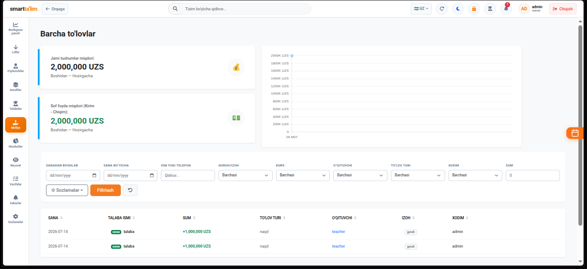

* **Ma'lumotlar jadvali** — To'lov sanasi, talaba F.I.SH, dars guruhi, kassa turi, to'lov usuli va kiritilgan izohlar.

### B. Qarzdorliklar (Debtors List)
Balansi manfiy bo'lgan, ya'ni markazdan qarzi bor talabalar ro'yxatini tezkor ko'rish oynasi.

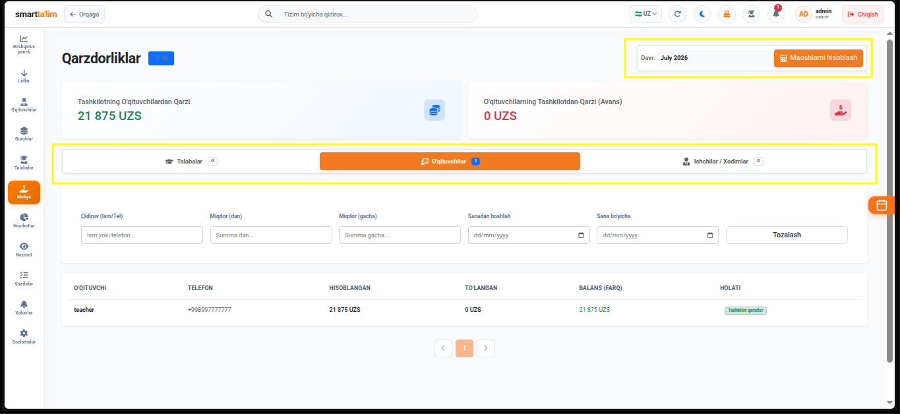

* **Tezkor SMS yuborish** — Ushbu oynadan turib qarzdorligi bor o'quvchilarga yoki ularning ota-onalariga ogohlantirish SMS xabarlarini ommaviy yuborish imkoniyati bor.

---

## 2. Pul Yechish, Xarajatlar va Toifalar

### A. Pul Yechib Olish (Withdraw)
Kassalardan pul mablag'larini yechish yoki hisobdan chiqarish operatsiyalari sahifasi.

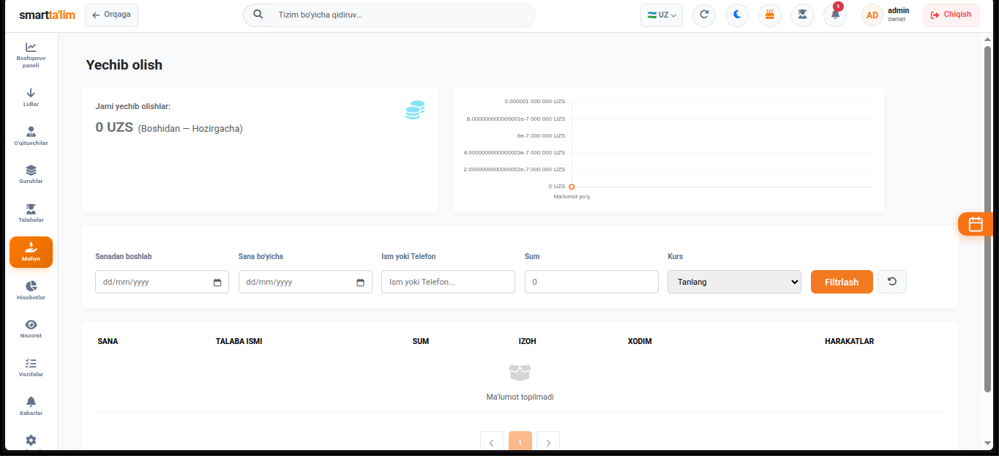

---

### B. Xarajatlar (Expenses)
O'quv markazining ijara, kommunal, marketing va boshqa operatsion chiqimlarini nazorat qilish paneli.

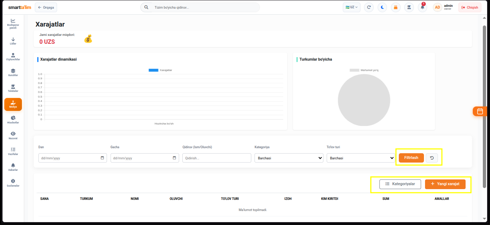
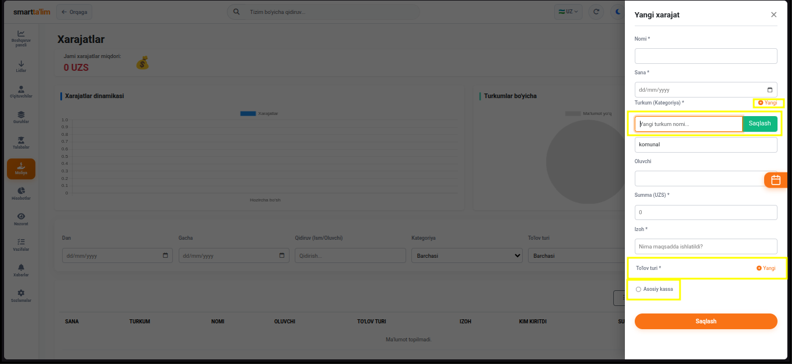

* **Xarajat qo'shish (Add Expense)** — Chiqim summasi, yechiladigan kassa, xarajat yo'nalishi (toifasi) va xarajatni tasdiqlovchi mas'ul shaxs ko'rsatiladi.

### C. Xarajat Kategoriyalari (Expense Categories)
Chiqimlarni to'g'ri guruhlash va tahlil qilish uchun xarajat yo'nalishlarini (kategoriyalarini) boshqarish oynasi.

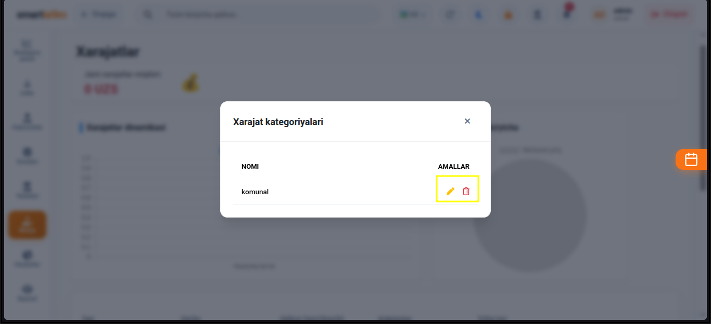

---

## 3. Oylik Maoshlar (Salaries)

Xodimlarning va o'qituvchilarning oylik maoshlarini hisoblash va ularni to'lash boshqaruv tizimi.

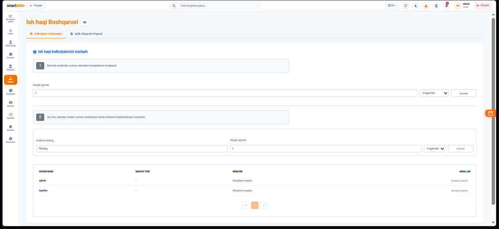
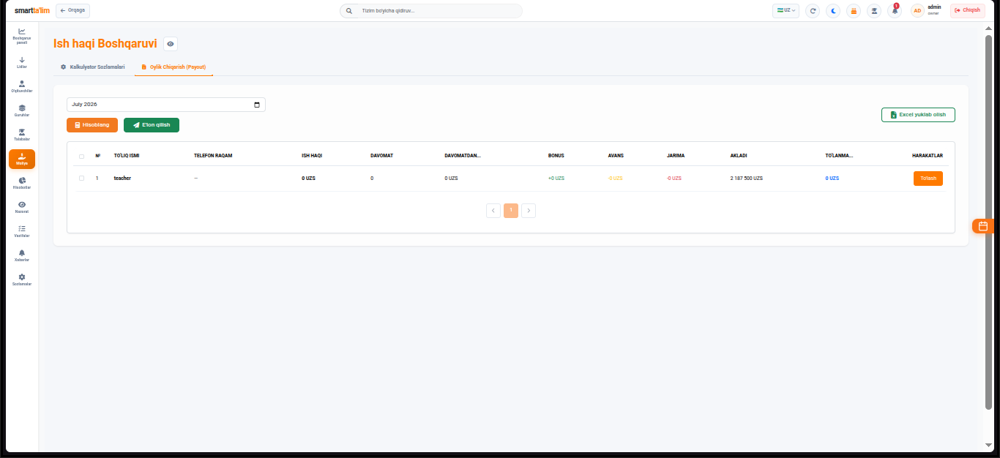

* **Oylik hisoblash** — O'qituvchilarning dars soatlari, talabalar soni yoki fiks stavka bo'yicha hisoblangan oyliklari jadvali.
* **Oylik to'lovini amalga oshirish** — Kassadan xodimga to'lov turi bo'yicha ish haqini to'lash va chiqim qilish oynasi.

---

## 4. Kassalar va Kirimlar (Cashboxes)

O'quv markazidagi pullar saqlanadigan barcha virtual va jismoniy hisoblar boshqaruvi.

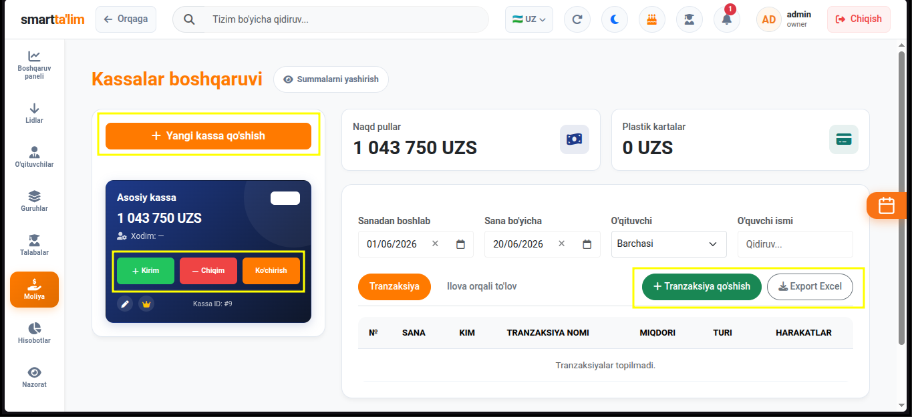
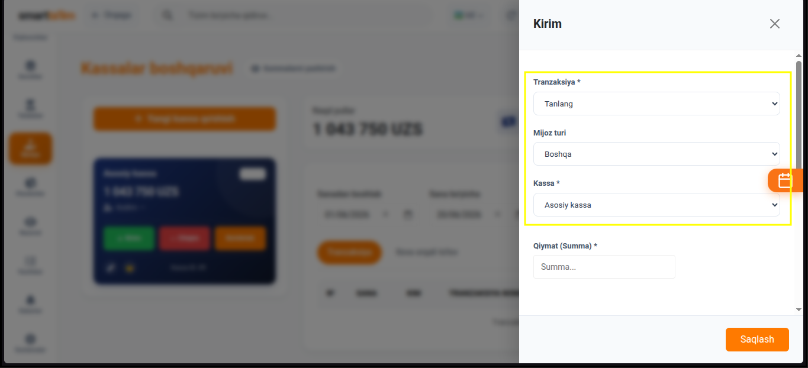

* **Kassa holati** — Har bir kassadagi (Naqd kassa, Plastik karta, Bank o'tkazmalari) qoldiq summalarning umumiy balansi.
* **Kassaga to'g'ridan-to'g'ri kirim (Deposit)** — Dars to'lovlaridan tashqari tashqaridan kelgan mablag'larni (investitsiya, hamkorlik pullari) kassaga kiritish oynasi.

---

## 5. Xodimlar Bonusi va Jarimalari

Xodimlarning ish samaradorligini rag'batlantirish yoki jazolash uchun foydalaniladigan moliya mexanizmlari.

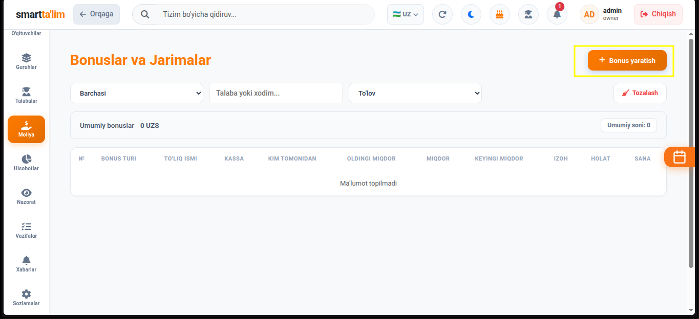
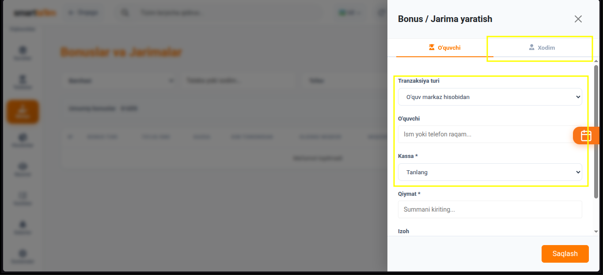
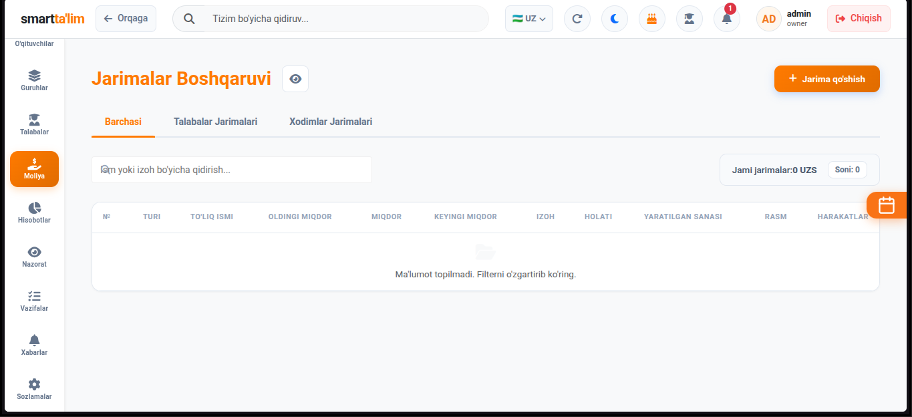

* **Kiritish oynasi** — Xodimga ma'lum bir harakati uchun bonus (mukofot) yoki jarima summasi yozilib, izoh bilan saqlanadi. Bu summa uning oylik maoshi chiqayotganda avtomatik inobatga olinadi.

---

## 6. Tranzaksiya Turlari (Transaction Types)

Moliya tizimidagi barcha kirim va chiqim operatsiyalarini to'g'ri tasniflash uchun tranzaksiya turlarini boshqarish.

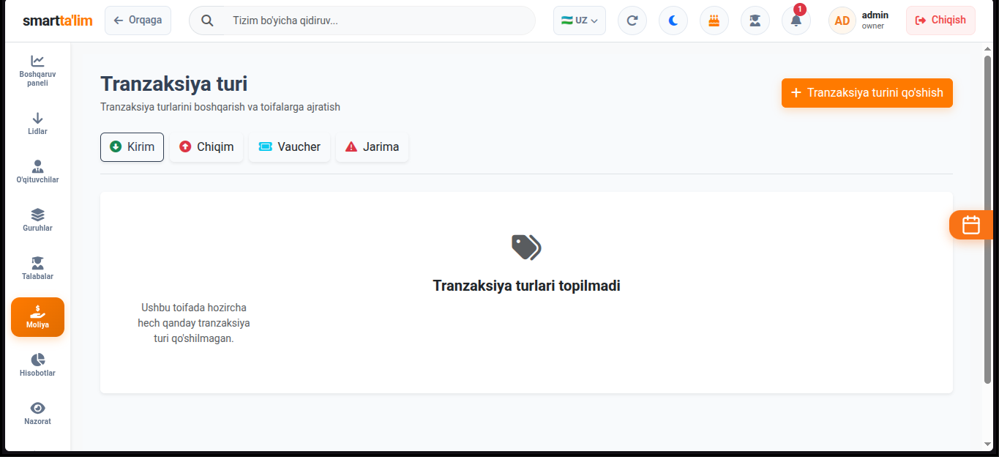
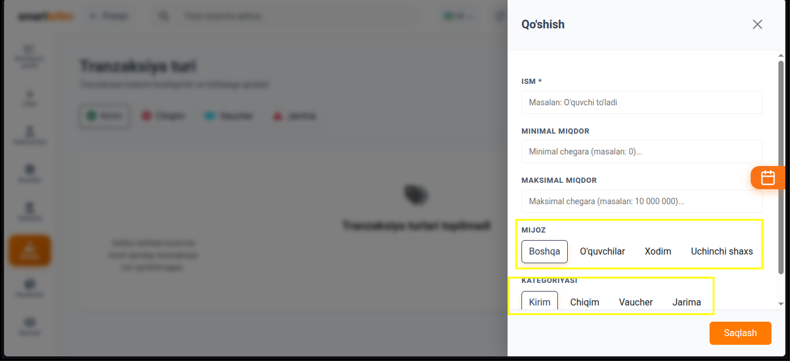

---

## 7. Moliyaviy Hisobotlar va Analitika

Menejerlar va o'quv markazi egalari uchun eng muhim tahliliy ma'lumotlar ombori.

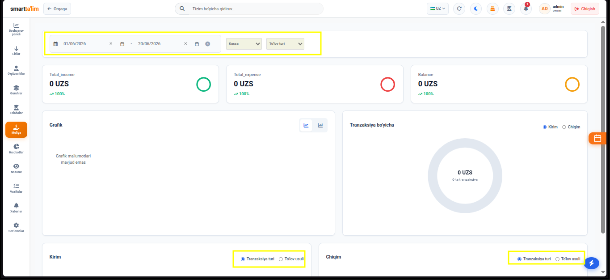

### A. Foyda va Zararlar hisoboti (P&L - Profit and Loss)
Markazning haqiqiy moliyaviy samaradorligini (kelgan real tushumlar va hisoblangan chiqimlar, oylik maoshlar ayirmasi) sof foyda sifatida hisoblab beruvchi jadval.

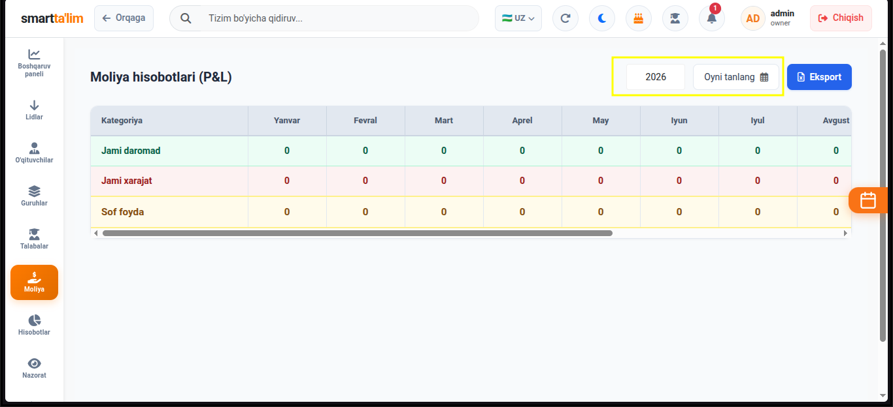

### B. Pul Oqimi (Cash Flow)
Kassalarga kirgan va chiqqan pullarning har bir kassa va kunlar kesimidagi sof harakat yo'nalishini nazorat qiluvchi jadval.

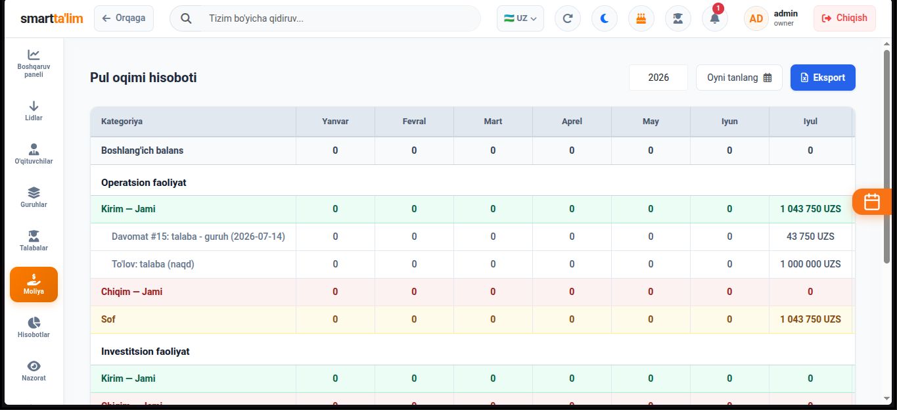

### C. Moliya Analitikasi (Financial Analytics)
Kirim va chiqimlar balansining grafik va diagrammalar orqali vizual tahlili.

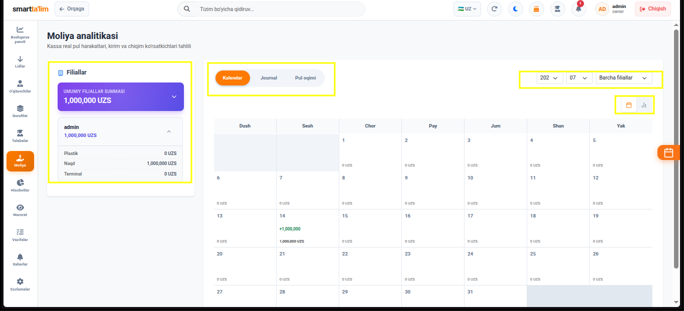

### D. Tranzaksiyalar Tarixi (Transactions Log)
Tizimda amalga oshirilgan barcha to'lovlar, xarajatlar va o'tkazmalarning batafsil, o'chirib bo'lmas to'liq tarixi (audit log).

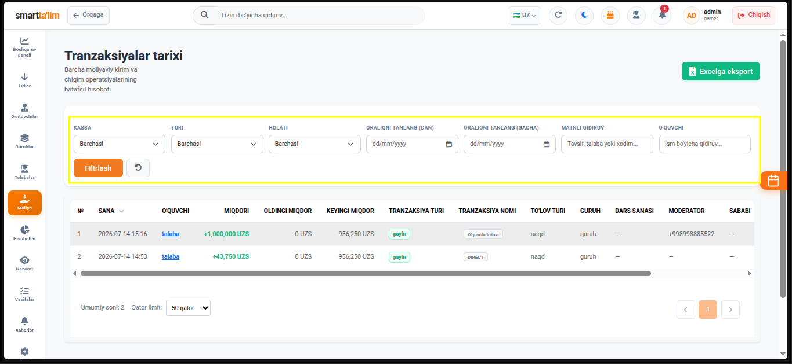
