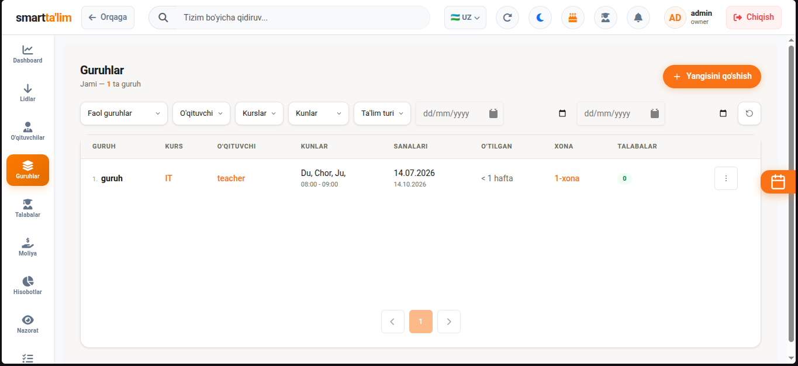
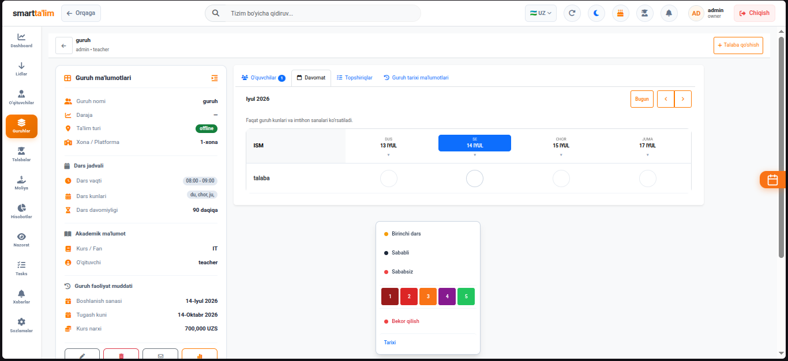
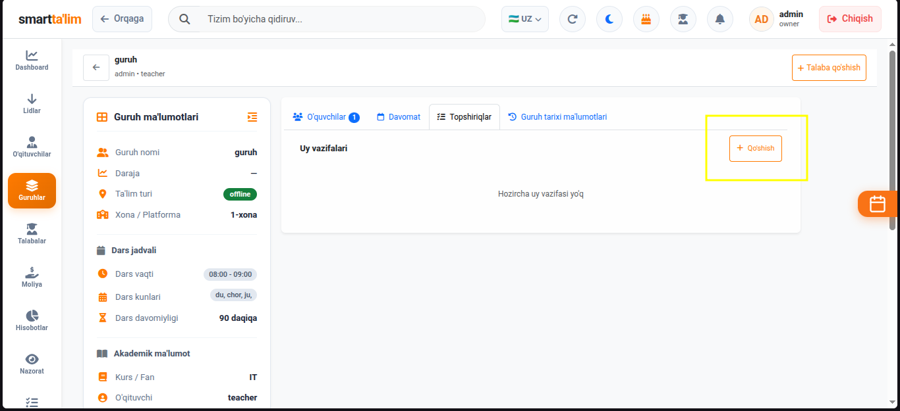
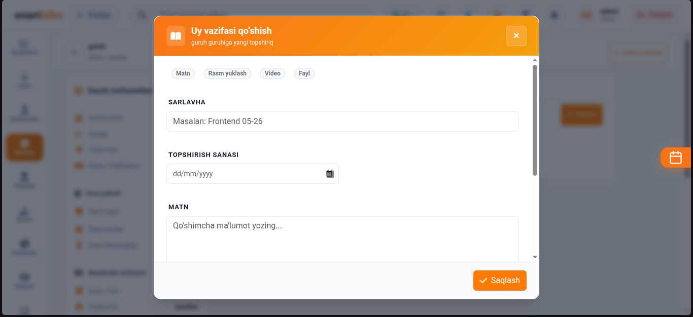

# Guruhlar va Dars Boshqaruvi

**Guruhlar** bo'limi — o'quv markazidagi barcha o'quv guruhlari, dars kunlari, xonalar, o'qituvchilar, talabalar tarkibi, kunlik davomat tizimi va uy vazifalarini boshqarish uchun xizmat qiladi.

---

## 1. Guruhlar Ro'yxati Sahifasi (Groups List)

Bu yerda markazda ro'yxatdan o'tgan barcha faol, yangi ochilayotgan va tugallangan dars guruhlari ro'yxati taqdim etiladi.

#### Jadval ustunlari va vazifalari:
1. **Guruh nomi**: Guruhning noyob nomi (masalan: *General English (Even Days)*). Guruh profiliga kirish uchun nom ustiga bosing.
2. **Kurs**: Guruh qaysi fan bo'yicha tashkil qilinganligi (masalan: *English*, *IT*).
3. **O'qituvchi**: Guruhga biriktirilgan asosiy dars beruvchi pedagog.
4. **Kunlar (Days)**: Dars kunlari (Juft kunlar: *Dushanba/Chorshanba/Juma*, Toq kunlar: *Seshanba/Payshanba/Shanba*, yoki maxsus kunlar).
5. **Vaqt va Xona**: Dars soati va o'tiladigan xona nomi.
6. **O'quvchilar soni**: Guruhda ayni damda o'qiyotgan faol talabalar soni.
7. **Status**: Guruh holati (Faol / Sinov jarayonida / Yakunlangan).

---

## 2. Yangi guruh yaratish (Create Group)

Yangi dars guruhini ochish va uning parametrlarini sozlash.

#### Yangi guruh yaratish yo'riqnomasi:
1. Sahifaning o'ng tepasidagi `Guruh yaratish` (yashil "+") tugmasini bosing.
2. Formani to'ldiring:
   * **Guruh nomi**: Guruh uchun tushunarli nom yozing.
   * **Kursni tanlash**: Avval tizim sozlamalarida yaratilgan kurslardan birini tanlang.
   * **O'qituvchini biriktirish**: Faol o'qituvchilar ro'yxatidan dars o'tadigan shaxsni tanlang (bir guruhga bir nechta o'qituvchi ham biriktirish mumkin).
   * **Dars jadvali (Kunlar va Vaqt)**: Dars kunlari va dars boshlanish/tugash vaqtini kiriting. Tizim xonaning bandlik holatini tekshiradi.
   * **Xona**: Dropdown ro'yxatidan dars o'tiladigan xonani tanlang.
   * **Limit va Narx**: Guruhga sig'adigan maksimal o'quvchilar soni va joriy guruh uchun maxsus narx belgilang.
3. `Saqlash` tugmasini bosing. Guruh dars jadvalida avtomatik ravishda paydo bo'ladi.

---

## 3. Guruh profili va Davomat (Attendance) boshqaruvi

Guruh nomini bosganingizda guruhning ichki sahifasi ochiladi. Bu administrator va o'qituvchilar uchun dars kunlari eng ko'p ishlatiladigan asosiy oynadir.

#### Guruh profilidagi asosiy vazifalar:
1. **Talabalar ro'yxati**: Guruhdagi talabalarning ismlari, telefon raqamlari va shaxsiy balanslari jadvali. Balansi qizil rangda bo'lgan talabalarning qarzdorligi borligini bildiradi.
2. **Talaba qo'shish**: Guruhga yangi talaba qo'shish uchun qidiruv maydonidan talabaning ismini yozib, guruhga biriktirasiz.
3. **Davomat olish (Kunlik rejim)**:
   * Dars kuni kelganda, har bir talabaning ismi yonida davomat belgilari chiqadi.
   * **Keldi (Present)**: Yashil rangdagi belgi. Tanlanganda, talabaning shaxsiy hisobidan dars narxiga teng summa avtomatik yechiladi (agar tizim sozlamalarida shunday o'rnatilgan bo'lsa).
   * **Kelmadi (Absent)**: Qizil rangdagi belgi. O'quvchi darsga kelmaganini bildiradi. Bu holatda sababli yoki sababsiz ekanligini belgilab ketish mumkin. Sababli bo'lsa, pul yechilmasligi sozlanishi mumkin.
   * **Sinov darsi (Trial)**: Talaba guruhda sinov darsida qatnashayotganini ko'rsatuvchi belgi.
4. **Davomatni saqlash**: Ro'yxatni belgilab bo'lgach, "Davomatni saqlash" tugmasini bosing. Ma'lumotlar saqlanadi va ota-onalarga (agar Telegram-bot ulangan bo'lsa) bolasi darsga kelganligi haqida bildirishnoma ketadi.

---

## 4. Guruh uy vazifalari (Homework) va Baholash

O'quvchilarning bilim darajasini tekshirib borish uchun darslar doirasida uy vazifalari yuklash tizimi.

#### Uy vazifasi berish yo'riqnomasi:
1. Guruh ichidagi `Uy vazifalari` tabiga o'ting.
2. `Yangi vazifa` tugmasini bosing.
3. Ochilgan oynada:
   * **Mavzu**: Vazifa sarlavhasini yozing (masalan: *Past Simple mashqlari*).
   * **Tavsif**: Vazifa shartlarini va topshiriqlarni batafsil tushuntiring.
   * **Muddati (Deadline)**: Vazifa qaysi sanagacha topshirilishi kerakligini belgilang.
4. `Yuborish` tugmasini bosing. Guruh a'zolari o'z kabinetlarida ushbu vazifani ko'ra oladilar.
5. **Baholash**: Talabalar vazifalarni bajargandan so'ng, o'qituvchi ularning ishlarini ochib, maxsus ball (baholash darajalari asosida) va izohlar qo'yishi mumkin.
