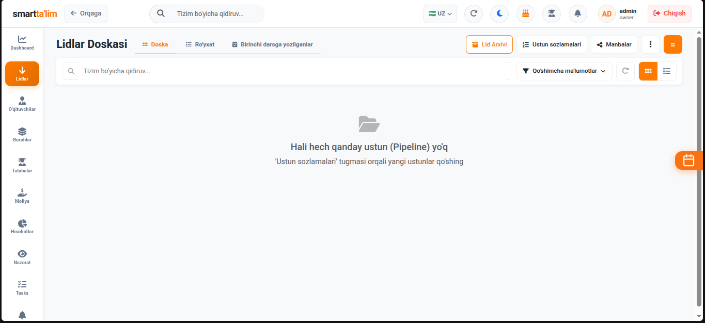
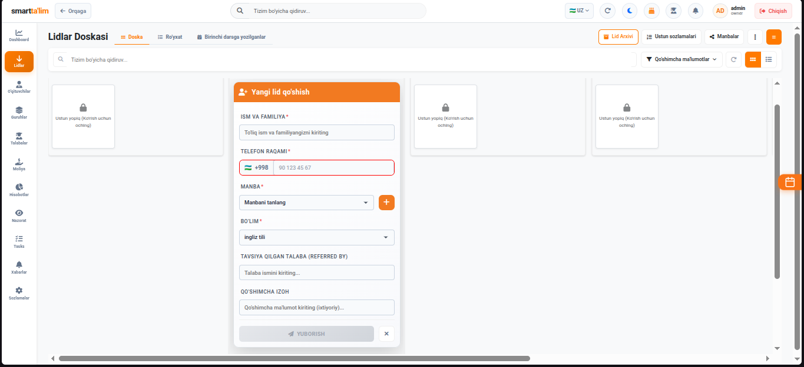
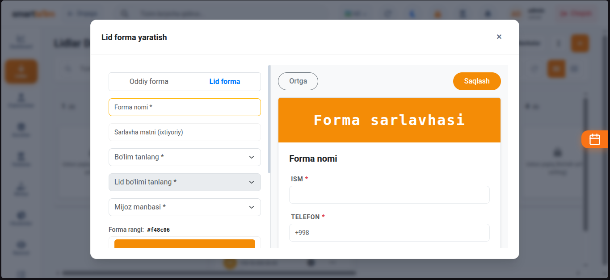
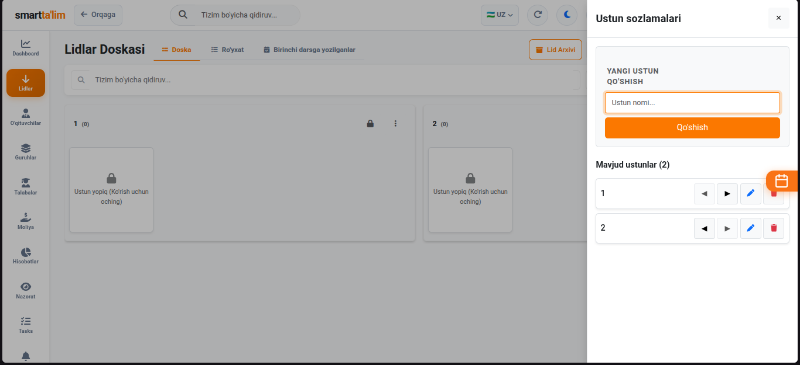
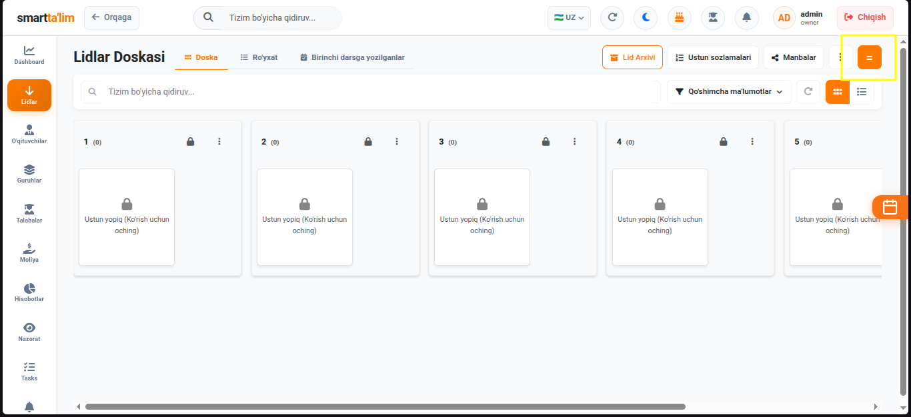
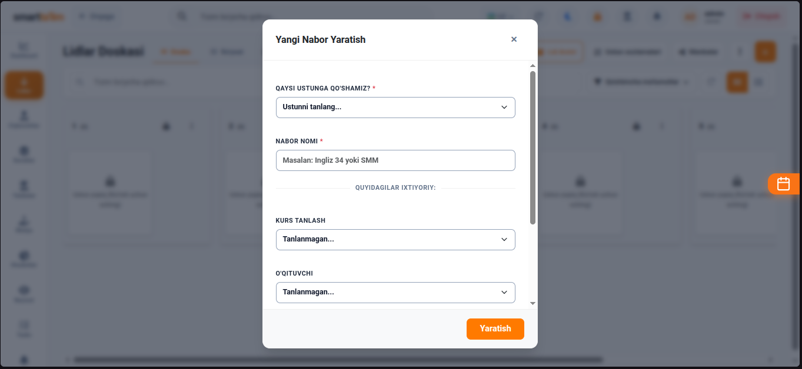
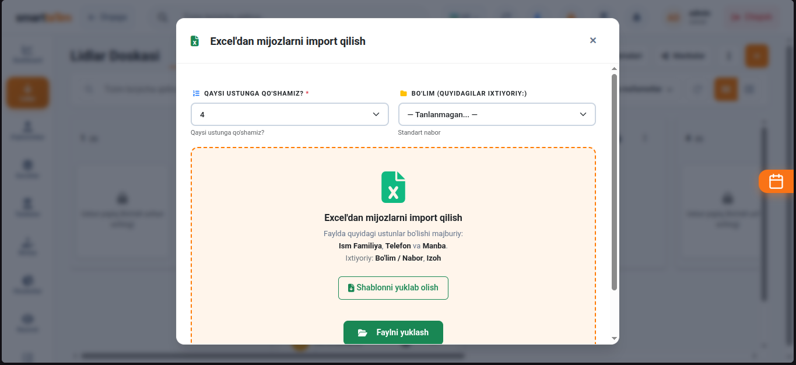
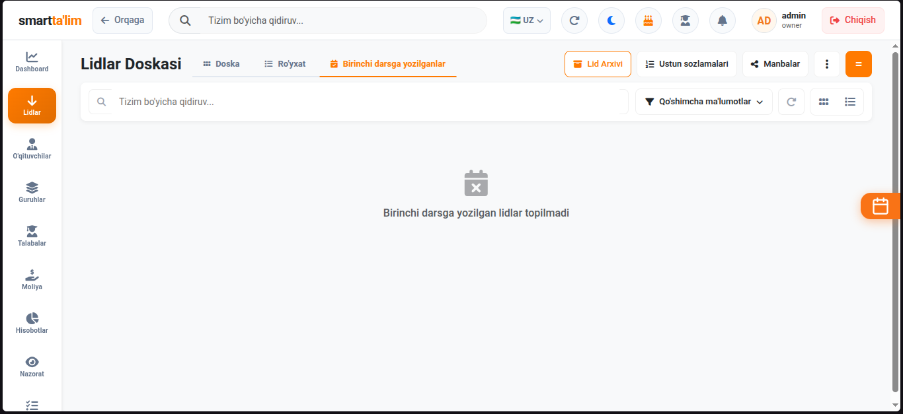
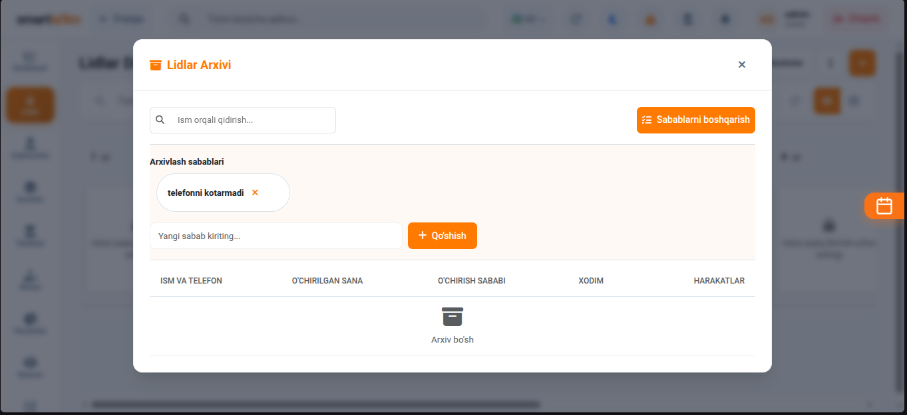

# Lidlar (Leads) Boshqaruvi va Savdo Voronkasi

**Lidlar (Leads)** — bu sizning o'quv markazingiz bilan qiziqqan, saytingiz, ijtimoiy tarmoqlar yoki telegram-bot orqali murojaat qoldirgan, lekin hali guruhlarga a'zo bo'lmagan potentsial mijozlar (o'quvchilar) bazasidir. Ushbu modul orqali administratorlar barcha murojaatlarni tizimli ravishda kuzatib boradi.

---

## 1. Lidlar Kanban Sahifasi

Bu sahifa o'quv markazining savdo voronkasi (sales funnel) rolini bajaradi. U Kanban doskasi ko'rinishida bo'lib, har bir ustun murojaatning ma'lum bir bosqichini aks ettiradi.

#### Kanban sahifasining boshqaruv elementlari:
1. **Bosqichlar (Ustunlar)**:
   * **Yangi murojaatlar (New)** — Telegram, Instagram yoki veb-saytdan tushgan birinchi murojaat kartochkalari.
   * **Aloqa o'rnatildi (Contacted)** — Admin telefon orqali gaplashgan va ma'lumot bergan lidlar.
   * **Sinov darsiga yozildi (Trial Scheduled)** — Darsni ko'rish uchun sinov darsiga kelishga rozi bo'lganlar.
   * **O'ylamoqda (Thinking)** — Darsga kelgan, narx yoki vaqt bo'yicha qaror qabul qilayotganlar.
   * **Muvaffaqiyatli yakunlandi (Won)** — Guruhga to'liq qo'shilgan va birinchi to'lovni qilgan talabalar.
   * **Rad etildi (Lost)** — O'qishni istamaganlar (masalan: uzoqligi, narxi qimmatligi sababli).
2. **Karta sudrash (Drag & Drop)** — Murojaat holati o'zgarganda (masalan, yangi lid bilan gaplashib uni sinov darsiga ko'ndirsangiz), kartani shunchaki chap tugma bilan bosib turib, kerakli ustunga sudrab o'tkazasiz. Tizim joriy ma'lumotlarni avtomatik yangilaydi.

---

## 2. Yangi murojaat (Lid) qo'shish

Har bir yangi murojaatni qo'lda kiritish yoki ro'yxatdan o'tkazish.

#### Yangi lid qo'shish yo'riqnomasi:
1. Kanban taxtasining tepasidagi `Lid qo'shish` (yashil rangli "+") tugmasini bosing.
2. Ochilgan formadagi maydonlarni to'ldiring:
   * **F.I.SH**: Mijozning ismi va familiyasi (masalan: *Eldor Alimov*).
   * **Telefon raqami**: Mijozning asosiy aloqa telefoni (xalqaro formatda).
   * **Qiziqqan kursi (Course Interest)**: Dropdown ro'yxatidan talaba qaysi fanga qiziqayotganini tanlang (masalan: *IELTS*, *Mental Arifmetika*).
   * **Murojaat manbasi (Source)**: Mijoz markazni qaerdan topganini belgilang (masalan: *Instagram reklama*). Bu reklama byudjetini to'g'ri taqsimlash uchun muhim.
   * **Izoh**: Mijoz bilan bog'liq maxsus eslatmalarni yozib qo'ying (masalan: *Faqat tushdan keyin dars qidirmoqda*).
3. **Saqlash**: Formaning pastki qismidagi `Saqlash` tugmasini bosing. Yangi lid avtomatik ravishda "Yangi murojaatlar" ustunida kartochka bo'lib paydo bo'ladi.

---

## 3. Kanban ustunlari sozlamalari (Column Settings)

O'quv markazingizning savdo jarayoniga qarab Kanban ustunlarini sozlash oynasi.

* **Bosqich qo'shish**: Agar savdo zanjiringizga yangi bosqich qo'shmoqchi bo'lsangiz (masalan: *Suhbatdan o'tdi* bosqichi), shu yerdan yangi ustun yaratishingiz mumkin.
* **Tahrirlash/O'chirish**: Keraksiz ustunlarni o'chirish yoki tartibini o'zgartirish imkoniyati.

---

## 4. Qabul (Nabor) Sozlamalari va guruhlash

Yangi o'quv mavsumi yoki yangi o'quvchilar qabuli (nabor) jarayonini tizimli guruhlash.

#### Nabor yaratish yo'riqnomasi:
1. `Nabor sozlamalari` oynasini oching.
2. Yangi qabul nomini belgilang (masalan: *Kuzgi qabul 2026* yoki *Sentabr Nabor*).
3. Boshlanish va tugash sanalarini kiriting.
4. Bu tizimga kirgan lidlarni qaysi mavsumda kelganligiga qarab filtrlash va marketing samaradorligini oylik tahlil qilish uchun yordam beradi.

---

## 5. Excel fayli orqali Lidlar importi

Mavjud talabalar bazangizni yoki ijtimoiy tarmoqlardan olingan telefonlar ro'yxatini tizimga ommaviy yuklash.

#### Import bosqichlari:
1. `Excel import` tugmasini bosing.
2. Tizim taklif qilgan **namunaviy shablon faylini** yuklab oling (Download Template).
3. O'z ma'lumotlaringizni ushbu shablon ustunlariga (Ism, Telefon, Kurs, Manba) mos ravishda to'ldiring.
4. Tayyor Excel faylingizni yuklash maydoniga qo'ying va "Yuklash"ni bosing. Tizim bir necha soniya ichida yuzlab lidlarni Kanban taxtasiga kiritib beradi.

---

## 6. Birinchi darsga yozish (First Lesson Setup)

Lidni birinchi bepul yoki sinov darsiga ro'yxatdan o'tkazish.

* **Dars sanasi va vaqti**: Sinov darsi qachon bo'lishini belgilang.
* **Xabarnoma yuborish**: Ushbu oyna orqali talabaga dars boshlanishidan oldin avtomatik eslatma SMS yuborilishini yoqib qo'yishingiz mumkin.

---

## 7. Rad etilgan lidlar arxivi (Leads Archive)

O'qishni rad etgan mijozlarni keyinchalik qaytadan ishlash uchun arxivda saqlash oynasi.

* **Arxiv sabablari**: Lidni arxivga solayotganda sababi ko'rsatiladi (masalan: *Narx to'g'ri kelmadi*).
* **Qayta faollashtirish**: Yangi kurslar ochilganda arxivdagi o'quvchilarni bitta tugma orqali faollashtirib, yana Kanban taxtasiga qaytarish mumkin.
