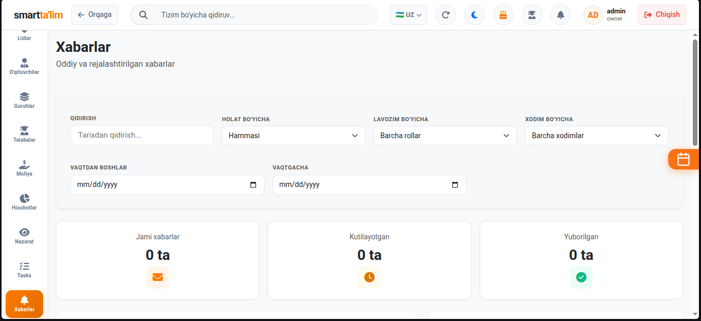
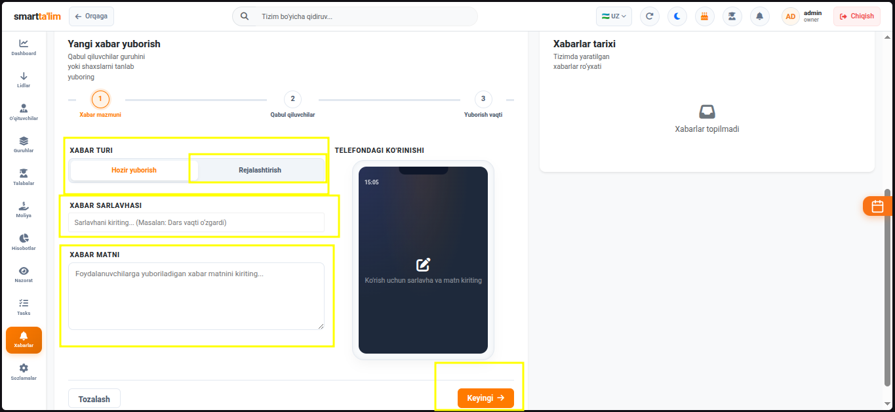
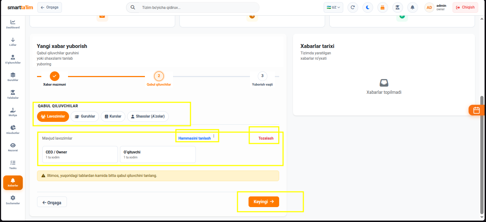
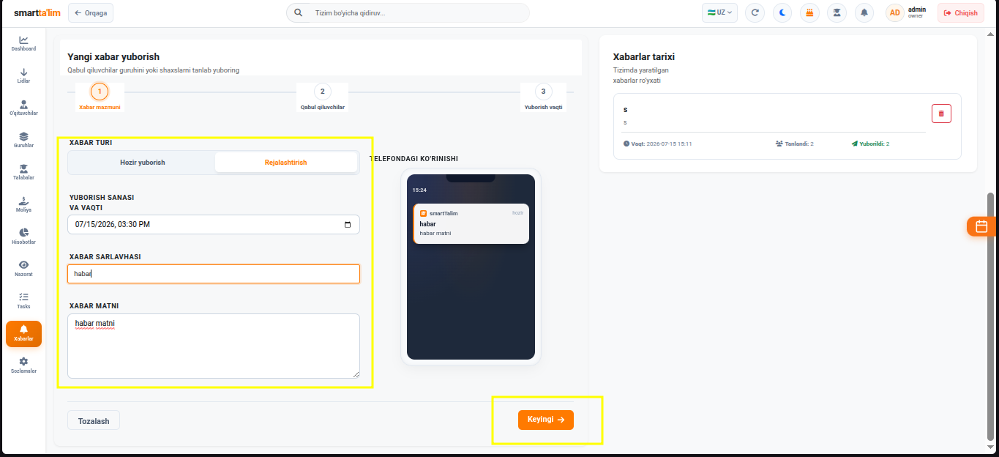
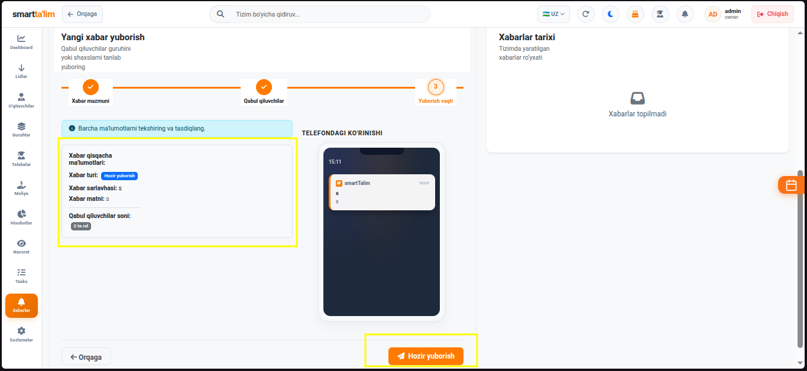

# Rejalashtirilgan SMS va Xabarlar

**Xabarlar (Messages)** moduli — bu o'quv markazi xodimlari va talabalariga oddiy yoki oldindan rejalashtirilgan SMS hamda ichki tizim bildirishnomalarini yuborish uchun mo'ljallangan markazlashgan kommunikatsiya tizimidir.

---

## 1. Xabarlar Bosh Sahifasi (Dashboard)

Xabarlar bo'limiga kirilganda sizni umumiy tahliliy ko'rsatkichlar va yuborilgan xabarlar tarixi kutib oladi.

### Asosiy elementlar va vazifalar:
1. **Qidiruv paneli (Search)** — Sarlavha yoki matn bo'yicha tarixni qidirish.
2. **Filtrlar (Filters)** — Holat (Kutilmoqda, Yuborildi, Xatolik), Lavozimlar, Xodimlar va yuborish sanasi bo'yicha saralash.
3. **Statistika paneli (Top Cards)**:
   * **Jami xabarlar** — Shu paytgacha yuborilgan va kutilayotgan barcha xabarlar soni.
   * **Kutilayotgan** — Rejalashtirilgan va hali yuborilmagan xabarlar soni.
   * **Yuborilgan** — Muvaffaqiyatli yetkazilgan xabarlar soni.
4. **Xabarlar Tarixi jadvali** — Yuboruvchi, qabul qiluvchi guruhlar, holati va yuborilgan sanani ko'rsatuvchi ro'yxat. U yerdan xabarlarni o'chirish yoki zudlik bilan yuborish (Send Now) mumkin.

---

## 2. 1-qadam: Xabar turi va matnini kiritish

Yangi xabar yuborish jarayoni 3 ta bosqichdan iborat bo'lib, birinchi bosqichda xabar turi, sarlavhasi va matni kiritiladi.

### Vazifalari:
1. **Xabar turi (Segmented Control)**:
   * *Oddiy xabar (Hozir yuborish)* — Tasdiqlangandan so'ng darhol yuboriladi.
   * *Rejalashtirilgan xabar* — Belgilangan sana va soatda avtomatik yuboriladi.
2. **Sarlavha (Title)** — Xabarning qisqa mavzusi (masalan: *Dars qoldirilishi haqida*).
3. **Xabar matni (Message Body)** — Foydalanuvchilarga yuboriladigan batafsil xabarnoma matni.
4. **Telefondagi ko'rinishi (Mobile Preview)** — Yon tomondagi maxsus telefon maketi orqali yozilayotgan xabarning haqiqiy telefonda qanday ko'rinishini real vaqt rejimida kuzatib borishingiz mumkin.

---

## 3. 2-qadam: Qabul qiluvchilarni tanlash

Ikkinchi bosqichda xabar kimlarga yuborilishi aniq filtrlar va toifalar orqali belgilanadi.

### Qabul qiluvchilar toifalari (Tabs):
1. **Lavozimlar (Roles)** — Xabarni ma'lum bir guruh xodimlarga yuborish (masalan: *CEO/Owner, Administratorlar, Menejerlar, O'qituvchilar*).
2. **Guruhlar (Groups)** — Tanlangan dars guruhlaridagi barcha talabalarga yuborish (masalan: *IELTS Morning* guruhidagi barcha talabalar).
3. **Kurslar (Courses)** — Muayyan fanga oid barcha guruh talabalariga ommaviy yuborish.
4. **Shaxslar (Members)** — Konkret bir yoki bir nechta foydalanuvchini ism yoki telefon raqami orqali qidirib, tanlab yuborish.

---

## 4. 3-qadam: Vaqtni rejalashtirish va Yakunlash

Uchinchi bosqichda rejalashtirilgan xabarlar uchun aniq jo'natish vaqti o'rnatiladi va xabar navbatga qo'yiladi.

* **Sana va Vaqt (Datetime Picker)** — Kalendar oynasidan jo'natilishi kerak bo'lgan kun va soat/daqiqa tanlanadi.
* **Yuborish (Submit)** — "Rejalashtirish" tugmasini bosgandan so'ng, xabar tizim bazasidagi rejalashtirilgan xabarlar navbatiga (Queue) qo'shiladi va belgilangan vaqtda avtomatik ravishda yuboriladi.
* **Tarixda ko'rinishi** — Yangi rejalashtirilgan xabar jadvalda **"Kutilmoqda" (Pending)** holatida paydo bo'ladi.
