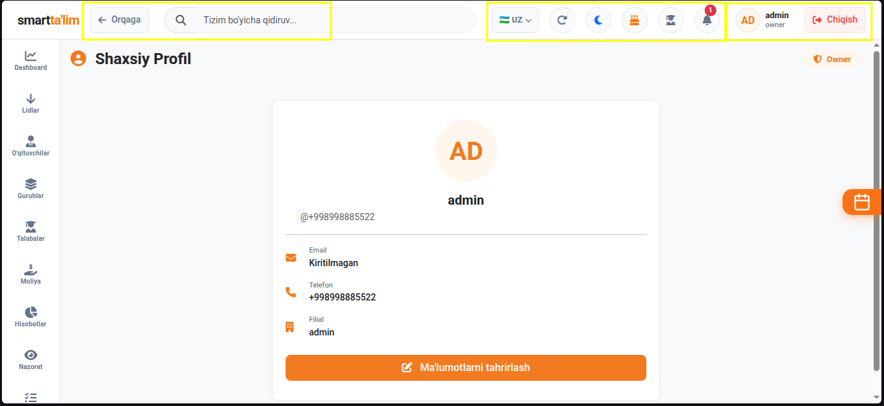
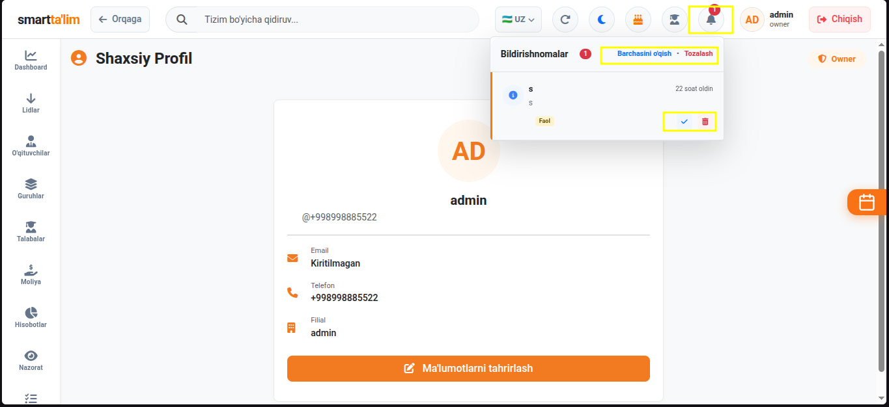
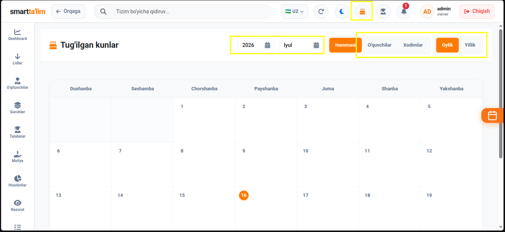
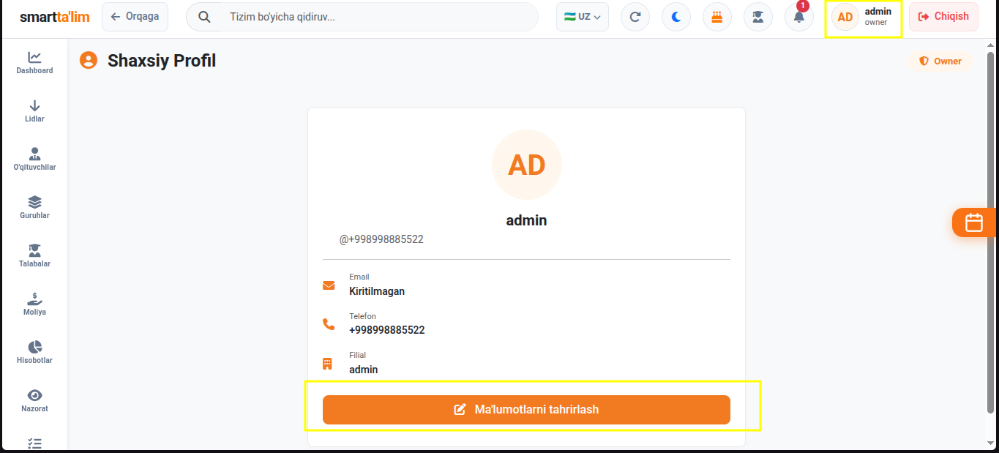
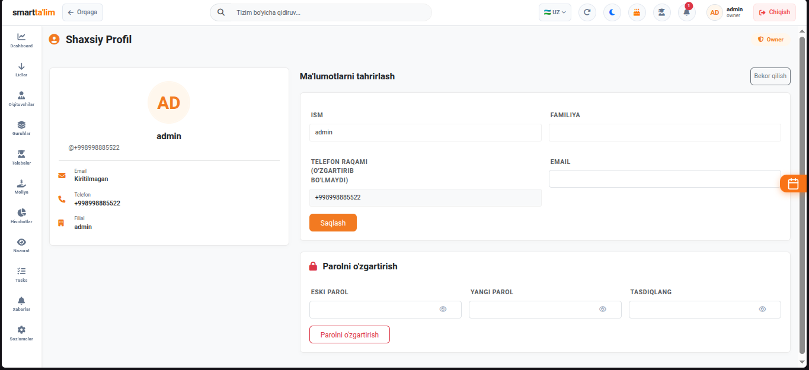

# Navigatsiya Paneli (Navbar va Foydalanuvchi Profili)

**Navigatsiya paneli (Navbar)** — bu tizim interfeysining eng yuqori qismida joylashgan doimiy boshqaruv paneli bo'lib, u orqali foydalanuvchilar o'z profillarini tahrirlashlari, bildirishnomalarni kuzatishlari, tug'ilgan kunlar haqida ma'lumot olishlari va filiallar o'rtasida o'tishlari mumkin.

---

## 1. Asosiy Navbar Elementlari

Siz ekranning yuqori qismida doimiy ko'rinib turadigan navigatsiya elementlarini boshqarishingiz mumkin.

#### Har bir elementning vazifasi va foydalanish yo'riqnomasi:
1. **Sidebar Toggle (Menyuni yashirish/ko'rsatish)**:
   * **Tugma ko'rinishi**: Uchta chiziqcha (Burger menyu).
   * **Vazifasi**: Chap tomondagi asosiy navigatsiya menyusini (Sidebar) yig'ish yoki yoyish. Bu kichik ekranli noutbuklarda ishchi maydonni kengaytirish uchun juda qulaydir.
2. **Filial tanlagich (Branch Selector)**:
   * **Tugma ko'rinishi**: Filial nomi yozilgan dropdown (ochiladigan) ro'yxat.
   * **Vazifasi**: Agar o'quv markazingizda bir nechta filial bo'lsa (masalan: *Chilonzor*, *Yunusobod*), ushbu tugma orqali joriy filialni o'zgartirishingiz mumkin. Uni almashtirishingiz bilan tizimdagi barcha dars jadvallari, guruhlar, talabalar va hisobotlar tanlangan filialga mos ravishda bir zumda yangilanadi.
3. **Til tanlagich (Language Selector)**:
   * **Tugma ko'rinishi**: Davlat bayroqlari yoki til qisqartmalari (`UZ` / `RU` / `EN`).
   * **Vazifasi**: Tizim interfeysini foydalanuvchiga qulay tilga o'tkazish.
4. **Tug'ilgan kunlar eslatmasi (Birthday Notification)**:
   * **Tugma ko'rinishi**: Tort (Cake) shaklidagi belgi.
   * **Vazifasi**: Bugun yoki joriy oyda tug'ilgan kunini nishonlayotgan talaba va xodimlarni tezkor aniqlash oynasi. Eslatmalar soni belgi ustida qizil raqamda chiqadi.
5. **Bildirishnomalar (Notification Panel)**:
   * **Tugma ko'rinishi**: Qo'ng'iroqcha yoki konvert belgisi.
   * **Vazifasi**: Yangi yozilgan vazifalar, to'lov tasdiqlari va tizim xabarlarini ko'rsatuvchi tezkor oyna.
6. **Profil menyusi (User Dropdown)**:
   * **Tugma ko'rinishi**: Foydalanuvchining rasmi va ismi.
   * **Vazifasi**: Ustiga bosilganda ochiladigan menyuda `Shaxsiy profil` (My Profile), `Sozlamalar` yoki `Tizimdan chiqish` (Logout) tugmalari joylashgan.

---

## 2. Bildirishnomalar va Tizim Xabarlari

Xabarlar va yangi tizim bildirishnomalarini real vaqt rejimida kuzatib borish oynasi.

#### Foydalanish:
* Har safar yangi lid qo'shilganda, vazifalar taxtasida sizga yangi karta biriktirilganda yoki tizimda muhim o'zgarish bo'lganda bu yerda xabarnoma paydo bo'ladi.
* Xabarni bosish orqali to'g'ridan-to'g'ri o'sha vazifa yoki talaba sahifasiga o'tishingiz mumkin.
* "Barchasini o'qilgan deb belgilash" orqali bildirishnomalar sonini tozalash imkoniyati mavjud.

---

## 3. Tug'ilgan kunlar sahifasi (Birthdays)

O'quv markazining barcha talabalari va xodimlari orasidan joriy davrda tug'ilgan kunini nishonlayotganlarni tabriklash bo'limi.

#### Tabriklash yo'riqnomasi:
1. **Ro'yxatni tekshirish**: Tug'ilgan kunlar oynasi ochilganda, bugun kimning tug'ilgan kuni ekanligi jadvalda chiqadi.
2. **Qidiruv va Saralash**: Talabalarni guruhlari yoki tug'ilgan kun sanalari bo'yicha saralash mumkin.
3. **SMS Tabriknoma yuborish (Tabriklash tugmasi)**:
   * Har bir talabaning yonida maxsus SMS yuborish tugmasi bor.
   * Uni bosganingizda tizimda oldindan tayyorlab qo'yilgan tabrik matni (shablon) ochiladi.
   * "Yuborish" tugmasini bosishingiz bilan talabaning telefon raqamiga (yoki ota-onasining raqamiga) tabrik xabari jo'natiladi.

---

## 4. Shaxsiy profil (My Profile) va uni boshqarish

Tizimga kirgan foydalanuvchining shaxsiy ko'rsatkichlari, lavozimi va aloqa ma'lumotlari sahifasi.

#### Profil tarkibi:
* **Shaxsiy ma'lumotlar bloki**: Foydalanuvchining F.I.SH, telefon raqami, lavozimi (Owner, Admin, Teacher va h.k.) va ro'yxatdan o'tgan sanasi.
* **Ish ko'rsatkichlari**: O'qituvchilar uchun dars soatlari, guruhlar soni; administratorlar uchun esa tizimdagi faollik ko'rsatkichlari.

---

## 5. Profilni tahrirlash (Edit Profile) va Parolni o'zgartirish

Foydalanuvchining shaxsiy xavfsizlik ma'lumotlari va rasmini yangilash oynasi.

#### Profilni tahrirlash bosqichlari:
1. **Ism va Telefon raqamini o'zgartirish**: Agarda ismingiz yoki telefon raqamingiz o'zgargan bo'lsa, tegishli maydonlarga yangi ma'lumotlarni yozing va "Saqlash"ni bosing.
2. **Rasmni yangilash (Avatar)**:
   * `Rasm yuklash` tugmasini bosing va kompyuteringizdan rasmni tanlang.
   * Rasm tanlangandan so'ng ekranda rasmni to'g'ri o'lchamda kesib olish (Avatar Crop Modal) oynasi ochiladi. Rasmni kerakli qismini belgilab, kesib oling va tasdiqlang.
3. **Parolni o'zgartirish (Xavfsizlik)**:
   * Akkauntingiz xavfsizligini ta'minlash uchun parolni har 3-6 oyda yangilab turish tavsiya etiladi.
   * `Eski parol` maydoniga joriy parolingizni yozing.
   * `Yangi parol` va `Yangi parolni tasdiqlash` maydonlariga o'rnatmoqchi bo'lgan yangi parolingizni yozing va saqlang.
