# Hisobotlar va Analitika

**Hisobotlar** bo'limi o'quv markazining barcha ko'rsatkichlarini (marketing, ta'lim sifati, moliyaviy barqarorlik, xodimlar samaradorligi) chuqur tahlil qilish uchun xizmat qiladi. Tizim rahbariga markaz faoliyatini to'g'ri baholashga yordam beradi.

---

## 1. O'quv jarayoni va Murojaatlar

### A. Darslar hisoboti (Lessons Report)
O'tilgan darslar, ularda qatnashgan talabalar soni va umumiy davomat ko'rsatkichi tahlili.

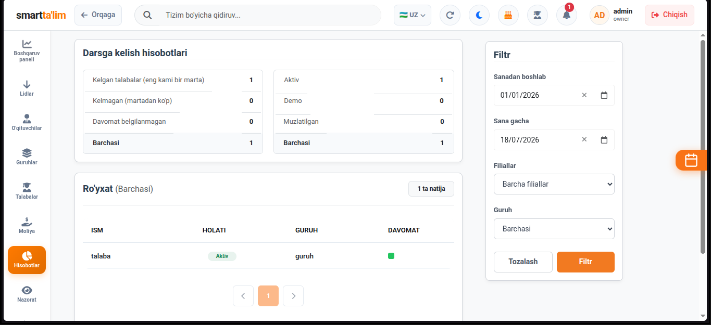

---

### B. Konversiya hisoboti (Conversion Rate)
Reklama manbalaridan kelgan lidlarning qanchasi talabaga aylanganini foizlarda solishtirish.

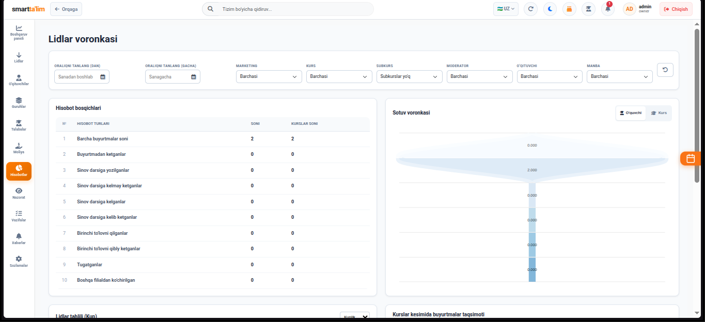

---

### C. Lidlar hisoboti (Leads Analytics)
Murojaatlar oylar kesimida qanday o'zgarayotgani va savdo voronkasining har bir bosqichidagi o'tish samaradorligi.

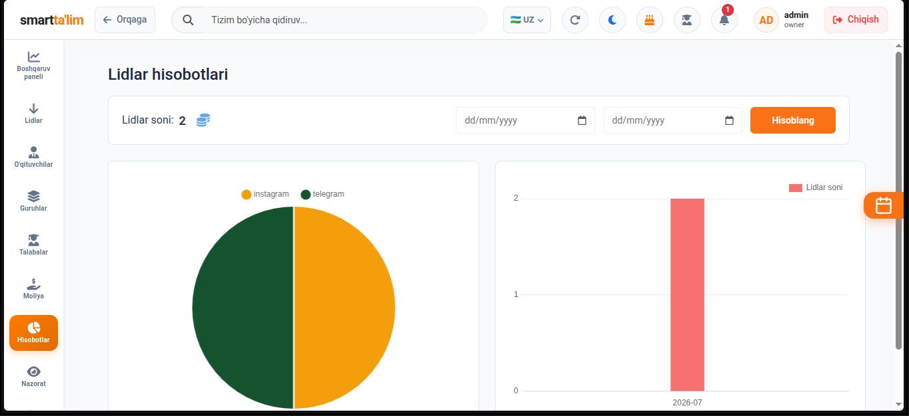

---

### D. Tark etganlar (Left Students Report)
Markazda o'qishni to'xtatgan talabalar soni va ularning darsdan ketish sabablari tahlili.

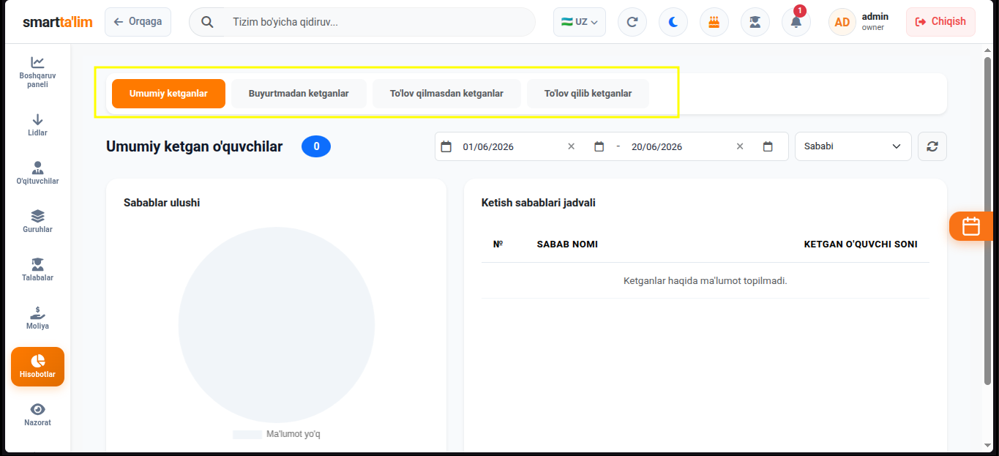

---

## 2. Moliyaviy va Rejali Hisobotlar

### A. Xodimlar balansi (Employee Balances)
Xodimlarga to'lanishi kerak bo'lgan maosh qoldiqlari, avanslar va hisob-kitoblar holati.

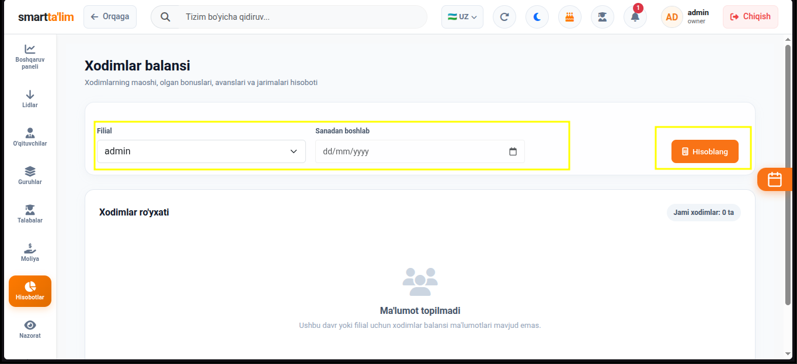

---

### B. Tushum rejasi (Expected Revenue Plan)
Yangi keladigan to'lovlar prognozi va oylik daromad rejalarining bajarilish ko'rsatkichi.

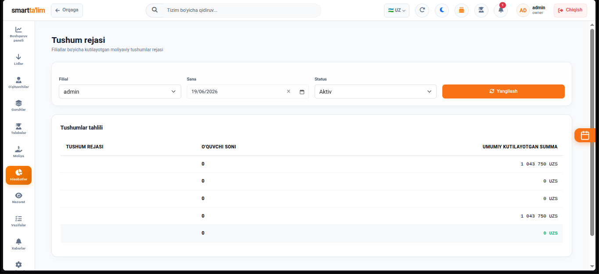

---

### C. Umumiy to'lanmaganlar (Unpaid Totals)
Darsga qatnashayotgan, lekin dars oyi uchun hali to'lov qilmagan talabalar va ularning to'lanmagan umumiy summalari.

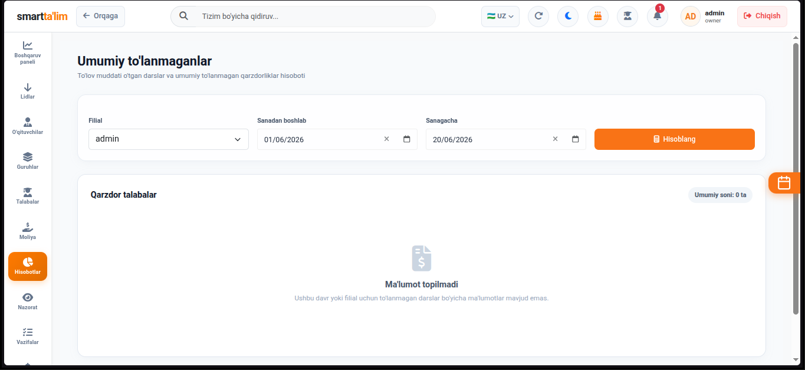

---

### D. Bekor qilingan to'lovlar (Cancelled Payments)
Xodimlar tomonidan kiritilib, keyinchalik bekor qilingan yoki o'chirilgan to'lovlar tarixi (moliyaviy shaffoflik uchun muhim).

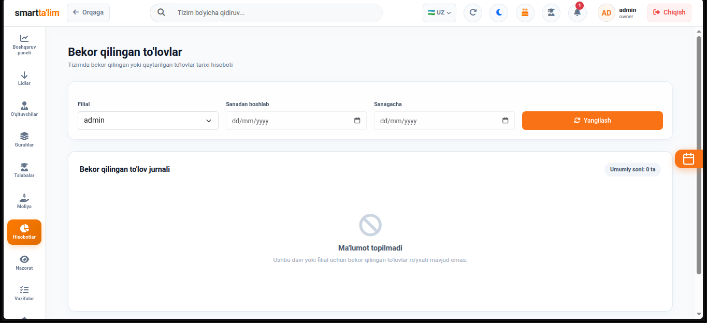

---

### E. Chegirma va bonuslar (Discounts & Bonuses)
Talabalarga berilgan barcha chegirmalar va xodimlarga yozilgan bonuslarning moliyaviy hisoboti.

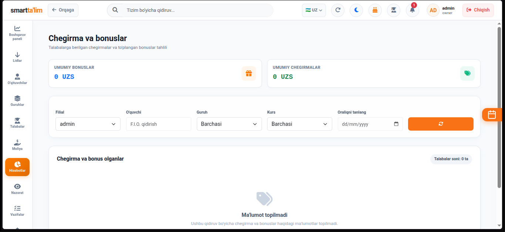

---

## 3. Samaradorlik (Efficiency) va Nazorat

### A. O'qituvchilar samaradorligi (Teacher Efficiency)
O'qituvchilarning dars sifati, davomat foizi va guruhlardan o'quvchilar chiqib ketish darajasi (drop-out rate) tahlili.

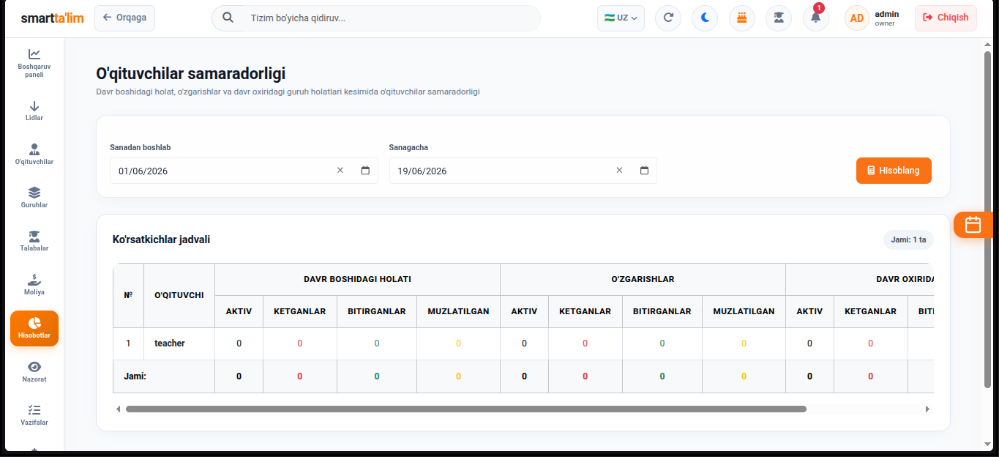

---

### B. Administratorlar samaradorligi (Admin Efficiency)
Administratorlarning lidlarni talabalarga aylantirish koeffitsiyenti, to'lov yig'ish samaradorligi va chaqiruvlarni o'z vaqtida bajarishi.

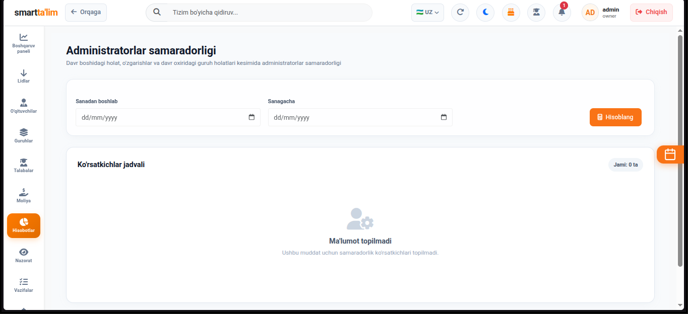

---

### C. Davomat qilinmagan guruhlar (Missing Attendance)
O'qituvchi yoki adminlar tomonidan o'z vaqtida davomati olinmagan guruhlar va kunlar ro'yxati (bu ijro intizomini nazorat qilishga yordam beradi).

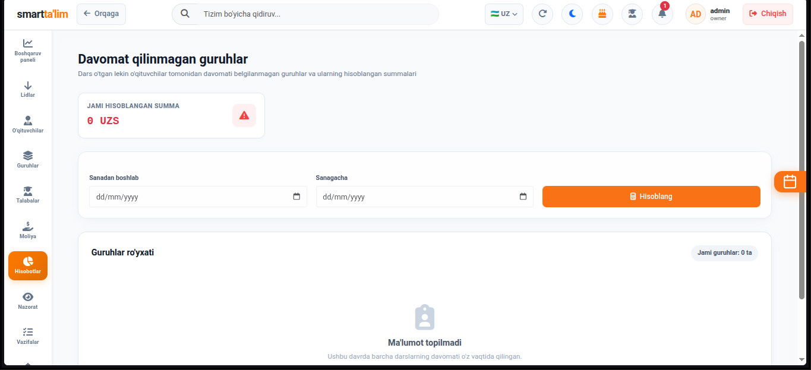
