# Tizim Sozlamalari (Settings)

**Sozlamalar** bo'limi — o'quv markazining barcha ichki parametrlari, avtomatlashtirish shartlari, filiallar, dars xonalari, maosh va KPI formulalari, integratsiyalar va ma'lumotlar zaxiralarini sozlash uchun xizmat qiladi. Bu bo'lim faqat Owner va Admin huquqiga ega foydalanuvchilarga ko'rinadi.

---

## 1. Ofis va Filial Sozlamalari

### A. Filiallar (Branches)
Markazning barcha jismoniy va virtual filiallarini boshqarish.

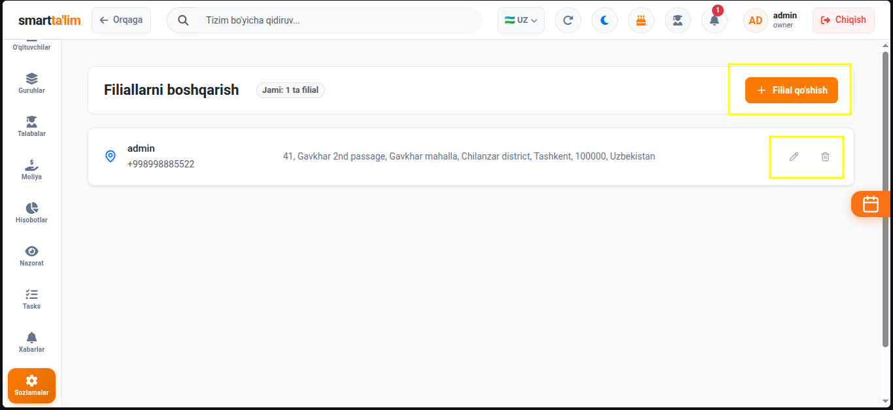
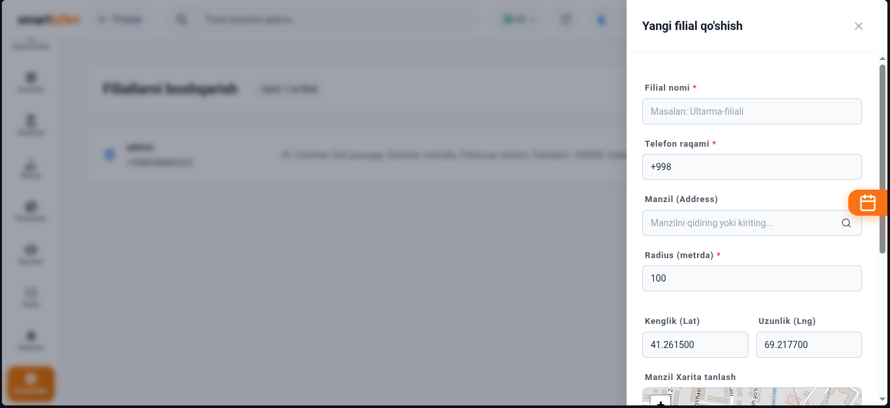

#### Filial qo'shish yo'riqnomasi:
1. Sozlamalardagi `Filiallar` bo'limiga o'ting.
2. `Yangi filial` tugmasini bosing.
3. Filial nomi, to'liq manzili va aloqa telefon raqamini kiritib saqlang.
4. Yaratilgan filial avtomatik ravishda yuqori navbar filiallar dropdown ro'yxatida paydo bo'ladi.

### B. Xonalar (Rooms)
Darslar tashkil etiladigan xonalar ro'yxatini sozlash.

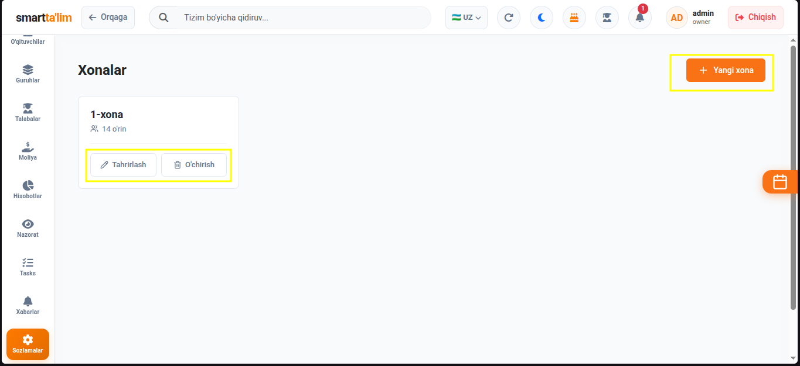
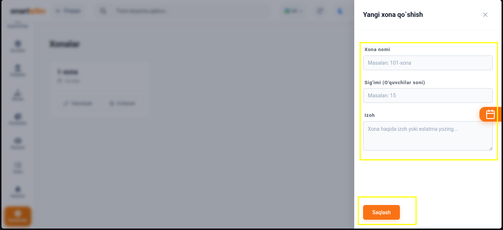

#### Xona qo'shish yo'riqnomasi:
1. `Xonalar` bo'limida `Xona qo'shish` tugmasini bosing.
2. Xona nomini (masalan: *London xonasi*, *Room 3*) va sig'imini (maksimal o'quvchi soni) yozing.
3. Bu sozlama guruh yaratilayotganda xonaning sig'imi va dars vaqtlari mosligini tekshirish uchun tizim tomonidan qo'llaniladi.

### C. Bayram kunlari (Holidays)
Markaz yopiq bo'ladigan va dars o'tilmaydigan rasmiy bayram va dam olish kunlarini belgilash.

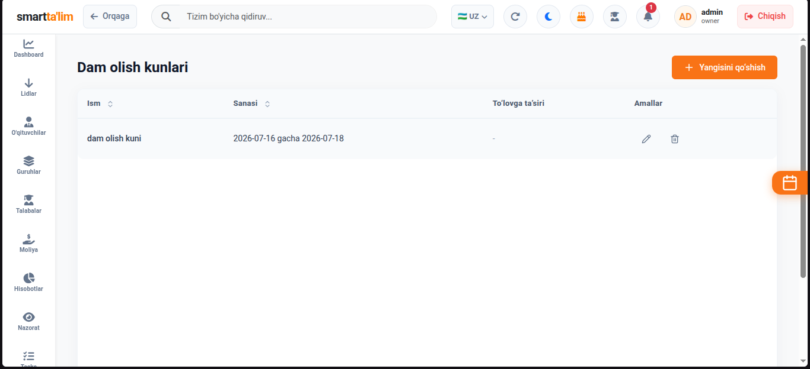
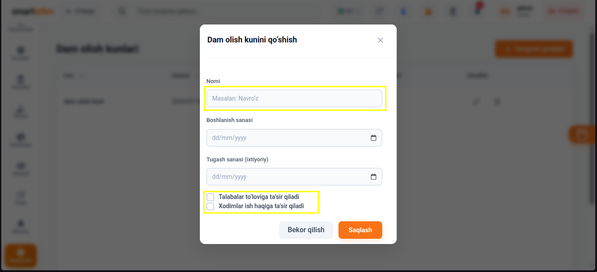

* **Qanday ishlaydi**: Bayram kuni kiritilgandan so'ng, tizim shu kunga to'g'ri kelgan barcha guruh darslarini avtomatik ravishda keyingi dars kuniga ko'chiradi va talabalarning balansidan pul yechilmaydi.

---

## 2. Xodimlar, Ketganlar va Arxiv

### A. Xodimlar boshqaruvi va Darajalari
Markazda faoliyat yuritadigan ma'muriy jamoani tizimga qo'shish, ularga tizimga kirish uchun rollar (Admin, Menejer, Receptionist) biriktirish va ularning malaka darajalarini sozlash.

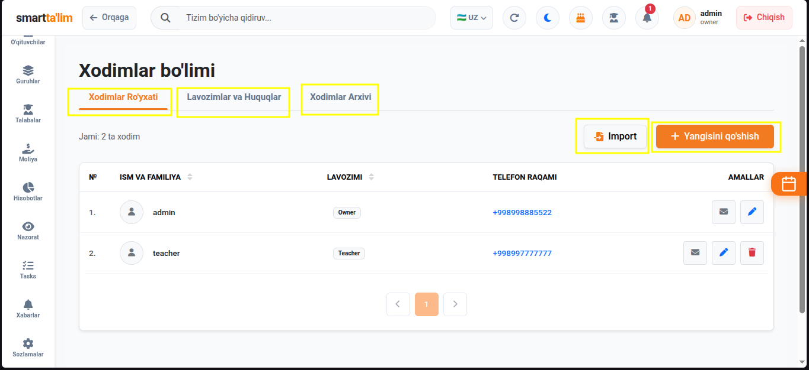
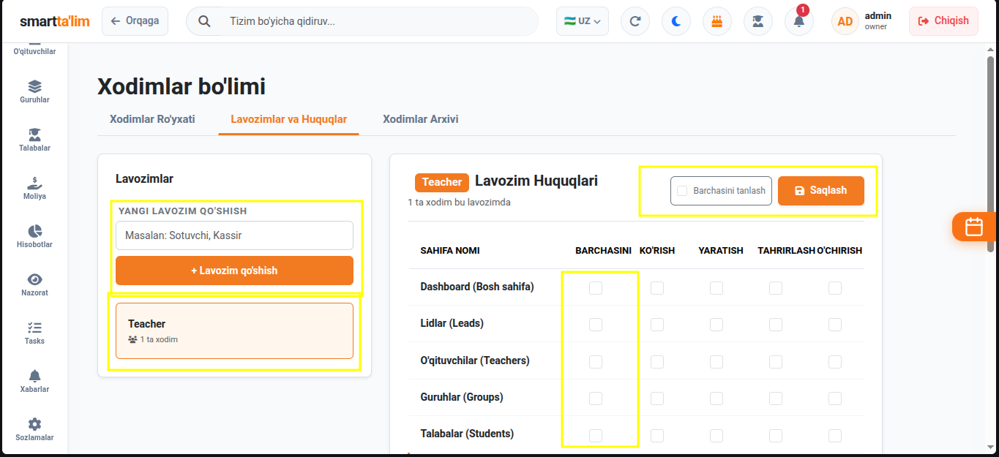

* **Xodim qo'shish**: Ism, telefon, rol va oylik fiks maoshini ko'rsatib xodim yaratiladi.
* **Malaka darajalari (Levels)**: Xodimlarning tajribasiga ko'ra darajalar belgilash (masalan: *Junior Admin*, *Senior Admin*).

### B. Arxivlar (Archive) va Arxiv sabablari
Tizim ma'lumotlar bazasi toza va tez ishlashi uchun eskirgan yoki tark etgan talaba, guruh va o'qituvchilarni arxivlash oynasi.

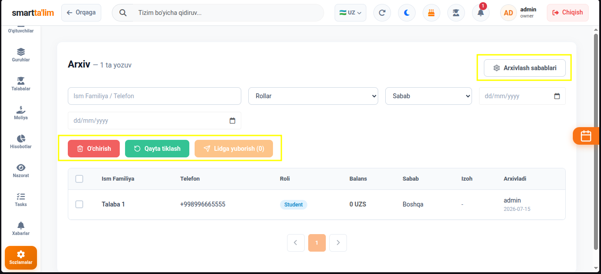
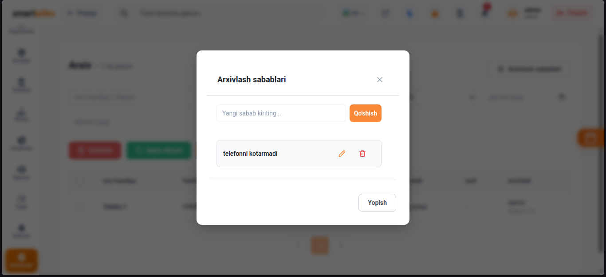
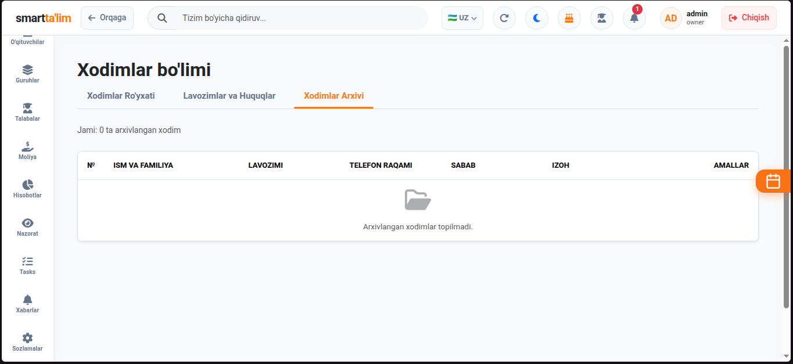

* **Arxivlash sababi**: Ma'lumot arxivga yuborilayotganda sababi ko'rsatiladi (masalan: *Kurs tugadi*, *Boshqa shaharga ko'chdi*).
* **Qayta tiklash**: Arxivdagi ma'lumotlarni istalgan vaqtda bitta tugma bilan faollashtirish mumkin.
* **Arxivdan lidlarga yuborish (Send to Lead from Archive)**: Arxivlangan eski talabani qaytadan marketing savdo taxtasiga (Leads Kanban) potentsial mijoz sifatida yo'naltirish oynasi.
  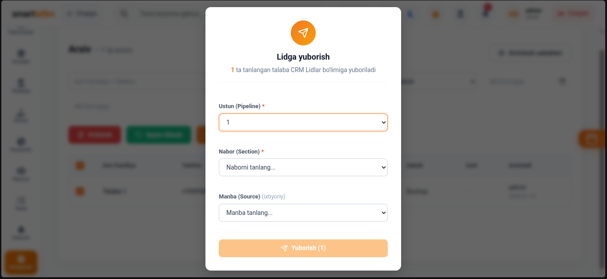

### C. Guruhdan ketganlar (Left Group) va Lidlarga yo'naltirish
Dars guruhlarini ma'lum sabablar bilan tark etgan talabalar monitoringi.

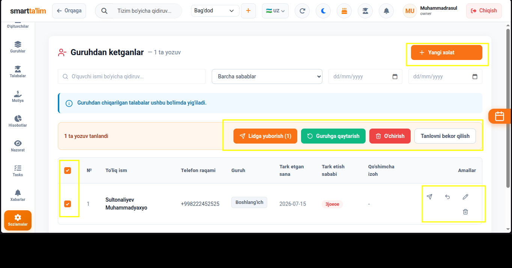
* **Ketgan talabani lidga o'tkazish**: Guruhdan ketgan o'quvchini qaytadan yangi guruhlarga jalb qilish uchun uni marketing voronkasiga (Leads) qaytarish oynasi.
  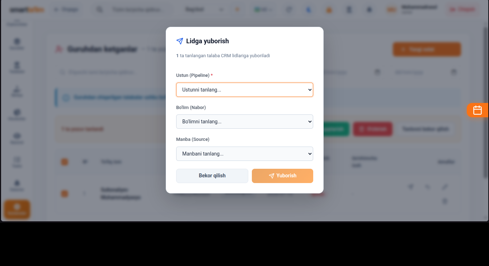

---

## 3. Kurslar, Imtihonlar va Baholash

### A. Kurslarni sozlash (Courses Setup)
Markazda o'tiladigan fan yo'nalishlarini (Kurslar) yaratish va ularning standart narxlarini belgilash.

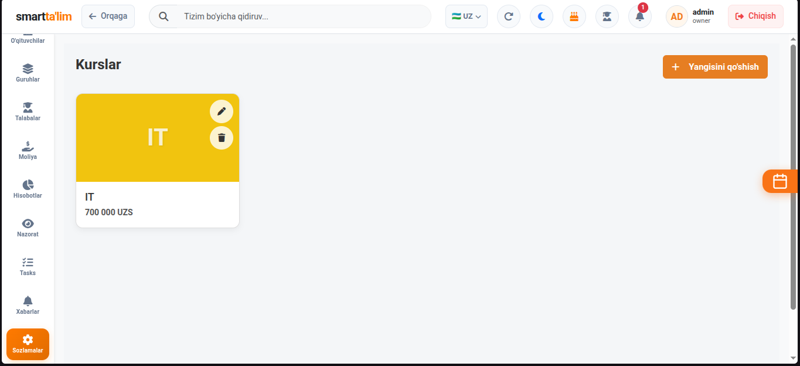
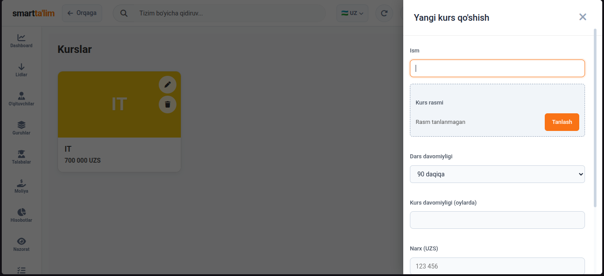

* **Kurs narxi**: Kursning oylik standart narxi.
* **Avtomatlashtirish qoidalari**: Balansdan pul yechish turi (darsbay yoki oylik).

### B. Imtihonlar va Baholash tizimi
Kurslar davomida olinadigan test va imtihonlarni sozlash, ularning baholash mezonlarini o'rnatish.

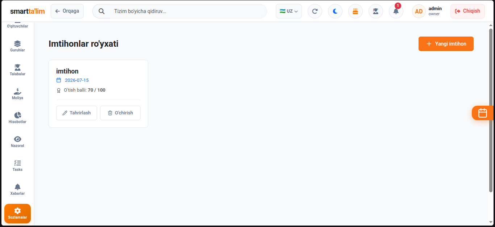
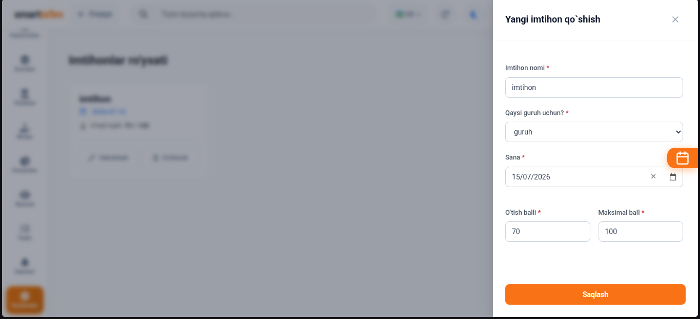
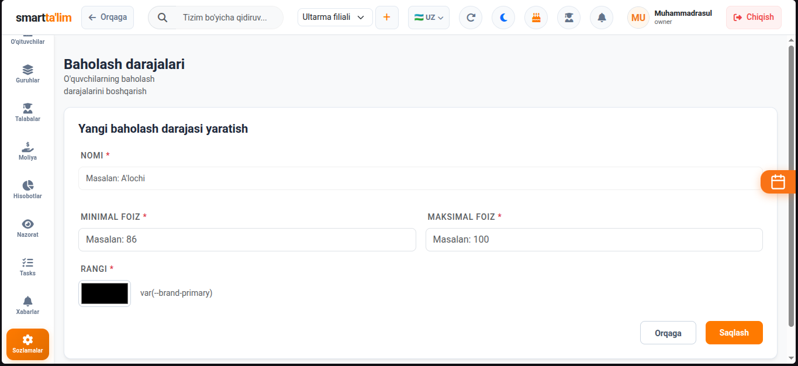

* **Baholash darajalari**: Imtihon ballari bo'yicha baholarni belgilash (masalan: `90-100 ball` = *A (A'lo)*, `80-89 ball` = *B (Yaxshi)*).

---

## 4. Moliyaviy avtomatlashtirish sozlamalari

O'quv markazining moliya tizimini avtomatlashtirish qoidalari.

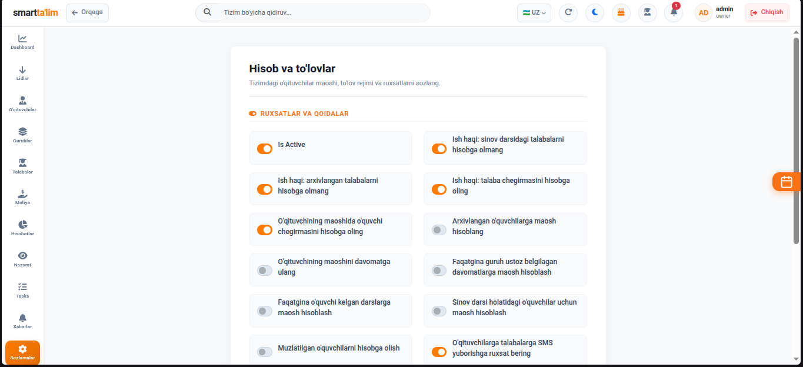

* **O'qituvchi maosh foizlari (Salary Percents)**: O'qituvchilar talabalar to'lagan summaning necha foizini oylik sifatida olishini belgilash:
  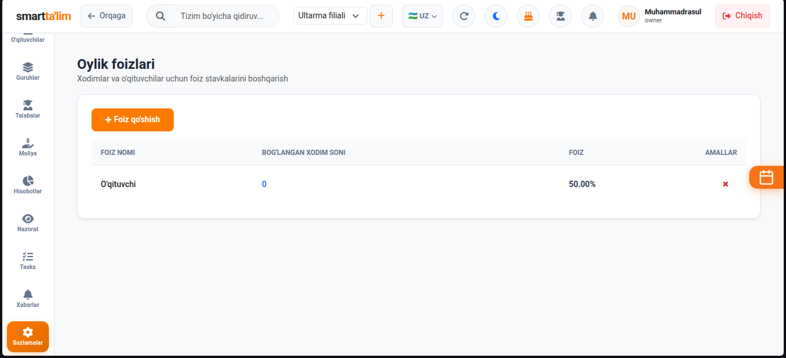
* **KPI sozlamalari**: Administrator va menejerlar uchun oylik rejaning bajarilish foiziga qarab bonus yoki jarima hisoblash formulalarini sozlash:
  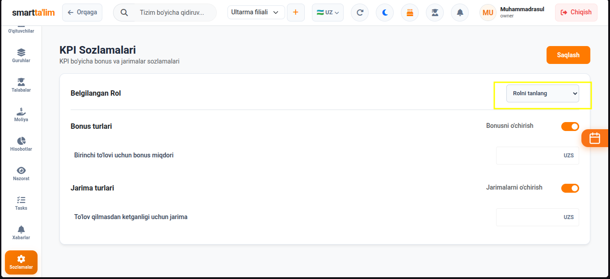
* **Menejer bonus/jarimalari**: Yig'ilgan to'lovlar rejasidan kelib chiqib avtomatik qo'shiladigan bonus yoki jarimalar:
  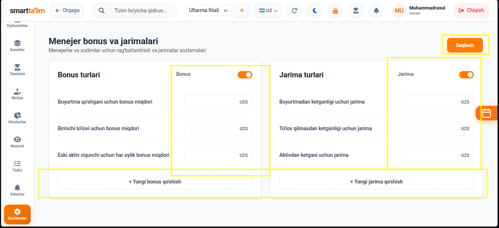
* **Bo'lim bonuslari**: Muayyan bo'limlar (masalan: *Call center*, *Marketing*) erishgan natijalar uchun mukofotlar:
  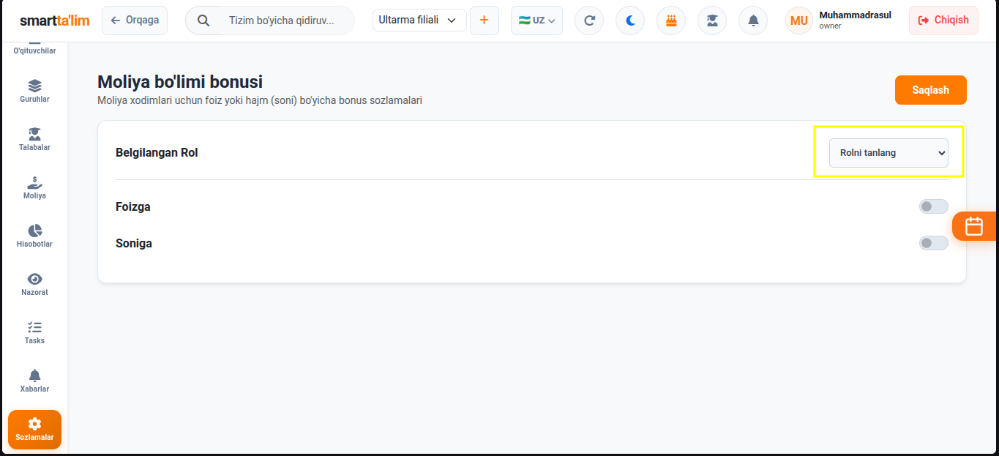
* **Avtomatik chegirmalar (Auto Discounts)**: Bir oiladan ikki kishi o'qiganda, yoki birdaniga ikki oyga to'lov qilganda talabaga avtomatik chegirma berish qoidalari:
  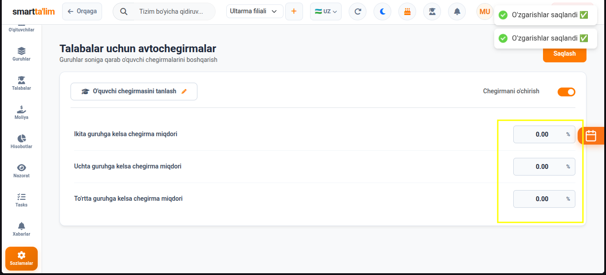

---

## 5. Chek shablonlari va Maxsus Maydonlar

### A. Chek Sozlamalari (Receipt - Chek)
To'lov qilgandan so'ng chop etiladigan qog'oz cheki dizayni va matnini tahrirlash oynasi.

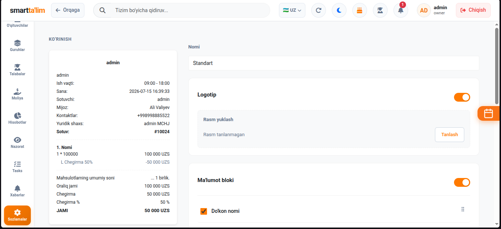

* Chek yuqorisidagi kompaniya logotipi, manzili, chek ostidagi rahmatnoma yoki eslatma matnini (masalan: *To'langan pullar qaytarilmaydi*) sozlash.

### B. Talaba Maxsus Maydonlari (Custom Student Fields)
Talaba kartochkasi yaratilayotganda kiritiladigan qo'shimcha ma'lumot turlarini kiritish (masalan: *Maktab raqami*, *Ota-onasining kasbi*).

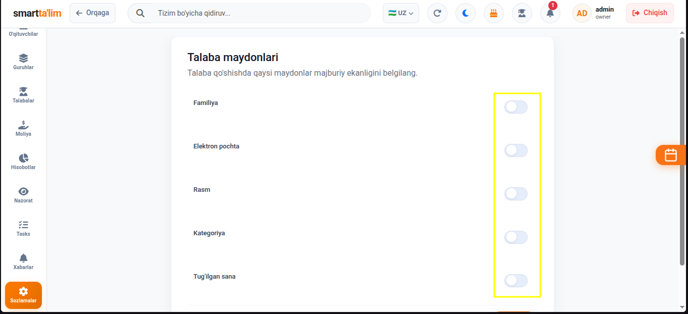
