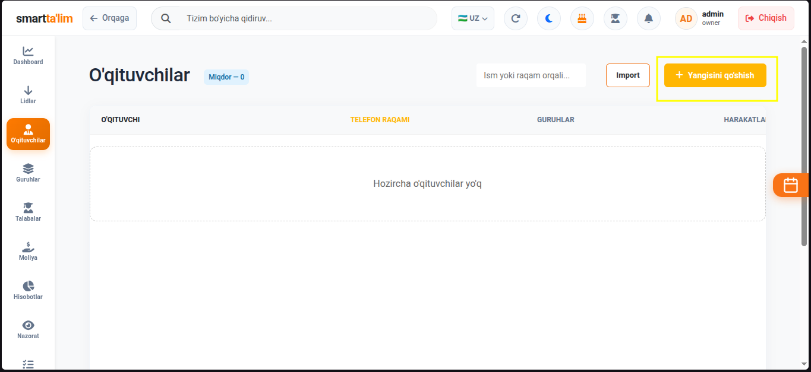
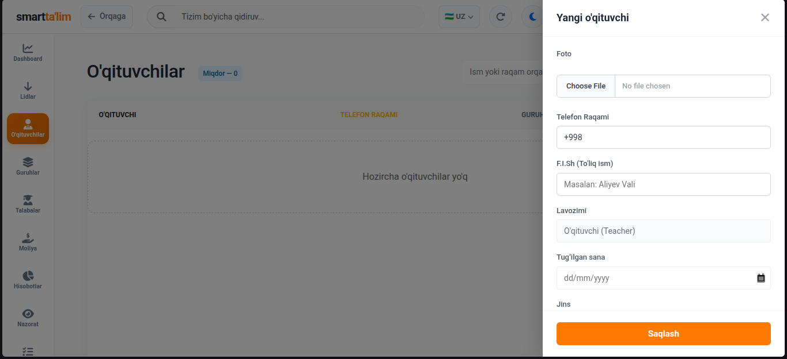

# O'qituvchilar va Xodimlar boshqaruvi

**O'qituvchilar va Xodimlar** bo'limi — o'quv markazidagi barcha o'quv va ma'muriy jamoani boshqarish, ularning tizimga kirish huquqlarini belgilash (Rollar va Ruxsatnomalar) hamda oylik maosh hisoblash shartlarini sozlash uchun xizmat qiladi.

---

## 1. O'qituvchilar (Teachers) Sahifasi

O'qituvchilar o'quv jarayonining asosiy ishtirokchilaridir. Bu sahifada o'qituvchilar ro'yxati, ularning mutaxassisligi va ularga biriktirilgan guruhlar boshqariladi.

#### Jadval ustunlari va tushuntirish:
1. **F.I.SH (O'qituvchi)**: O'qituvchining rasmi va ismi. Ism ustiga bosish orqali uning batafsil dars jadvali va guruhlari ro'yxatini ko'rish mumkin.
2. **Telefon raqami**: O'qituvchining shaxsiy telefoni. Bu raqam uning tizimga kirishi uchun login bo'lib ham xizmat qiladi.
3. **Guruhlar soni**: O'qituvchiga biriktirilgan faol guruhlar soni.
4. **Mutaxassisligi**: O'qituvchi o'tadigan kurs fanlari (masalan: *English*, *IELTS*, *Kids English*).
5. **Amallar (Actions)**: Tahrirlash (Edit) yoki tizimdan o'chirish (Delete) tugmalari.

---

## 2. Yangi o'qituvchi qo'shish (Create Teacher)

Tizimga yangi pedagog xodimni ro'yxatdan o'tkazish va uning ish shartlarini sozlash.

#### O'qituvchi qo'shish bosqichlari:
1. Sahifaning o'ng tepasidagi `O'qituvchi qo'shish` (yashil "+") tugmasini bosing.
2. Formani to'ldiring:
   * **F.I.SH**: O'qituvchining ismi va familiyasi.
   * **Telefon raqami**: O'qituvchining aloqa telefoni.
   * **Mutaxassislik (Fani)**: Pedagog o'tadigan dars fanlari yo'nalishi.
   * **Maosh turi (Salary Type)**: O'qituvchi uchun oylik maosh qanday hisoblanishini belgilash (bu moliya bo'limi uchun juda muhim):
     * *Foiz stavkasi (Percentage)* — O'qituvchi o'z guruhidagi talabalar to'lagan summaning ma'lum foizini maosh sifatida oladi (masalan: 40%).
     * *Soatbay maosh (Hourly)* — O'tilgan har bir dars soatiga qarab belgilangan oylik.
     * *Fiks oylik (Fixed Salary)* — Dars va talabalar sonidan qat'i nazar har oy beriladigan belgilangan oylik maosh.
3. `Saqlash` tugmasini bosing. O'qituvchi tizimga qo'shiladi va unga login paroli yuboriladi.

---

## 3. Xodimlar (Staff) Boshqaruvi va Rollar

Markazning boshqa ma'muriy xodimlari (Menejerlar, Administratorlar, Receptionistlar) ro'yxatini boshqarish va ularning tizimga kirish huquqlarini cheklash.

*(Eslatma: Xodimlar va arxiv sozlamalari [Tizim Sozlamalari (Settings)](settings.md) bo'limidagi Xodimlar bo'limida batafsil yoritilgan)*

### Tizimdagi asosiy rollar (System Roles):
* **Owner (Tashkilot egasi)** — Tizimda cheksiz huquqlarga ega, moliya, biling, filiallar va sozlamalarni to'liq boshqaradi.
* **Superadmin / Admin** — Barcha asosiy modullarga kiradi, lekin billing va bosh sozlamalarda ba'zi cheklovlari bo'lishi mumkin.
* **Manager (Menejer)** — Lidlar, guruhlar va talabalarni to'liq boshqaradi. Moliya hisobotlariga ruxsati cheklanishi mumkin.
* **Receptionist** — Talabalarni kutib oladi, to'lovlar qabul qiladi, davomatlarni tekshiradi. Sozlamalarga va hisobotlarga ruxsati yo'q.
* **Teacher (O'qituvchi)** — Faqat o'zining dars jadvali, guruhlari va talabalarining davomatini ko'radi va belgilaydi. Markazning boshqa ma'lumotlarini ko'ra olmaydi.
* **Student (Talaba)** — Faqat o'z profili, balansi, coinlari va dars jadvallarini ko'ra oladi.
