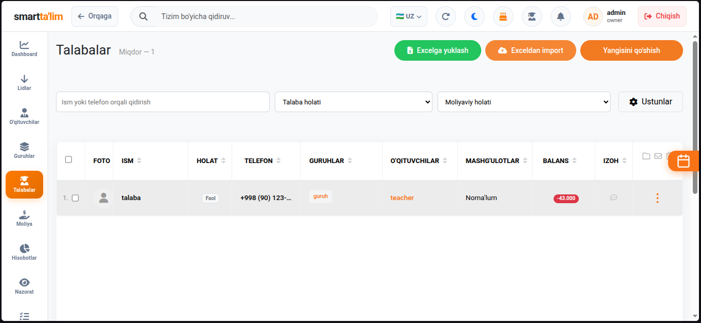
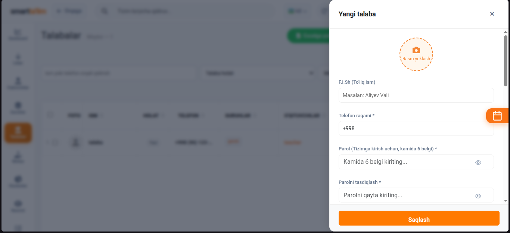
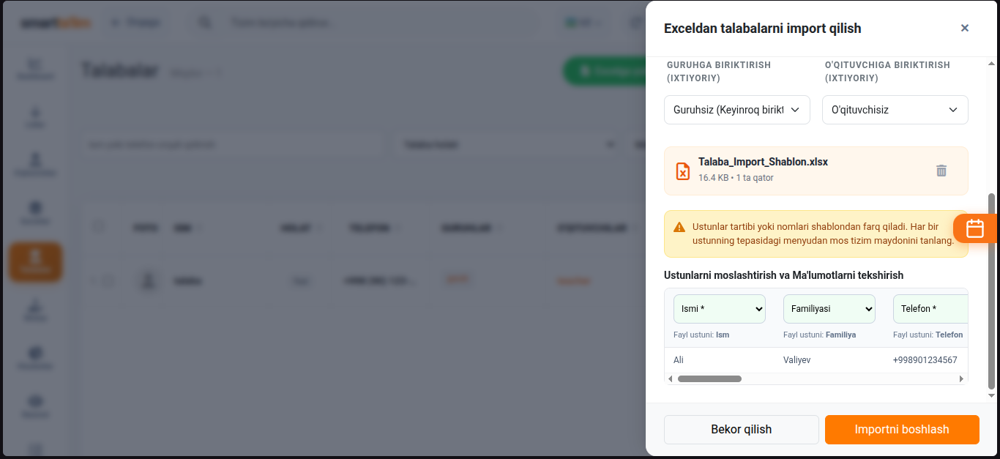
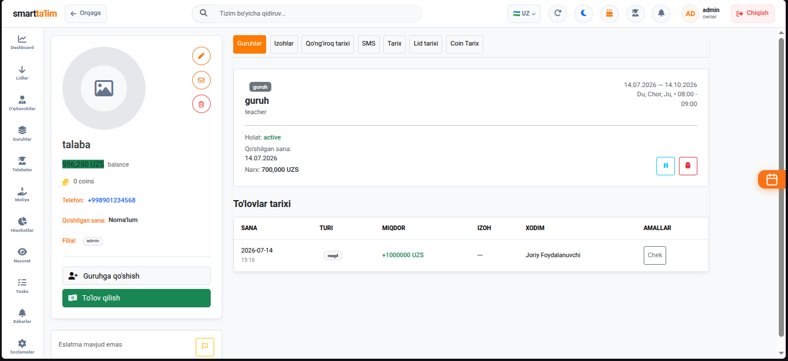
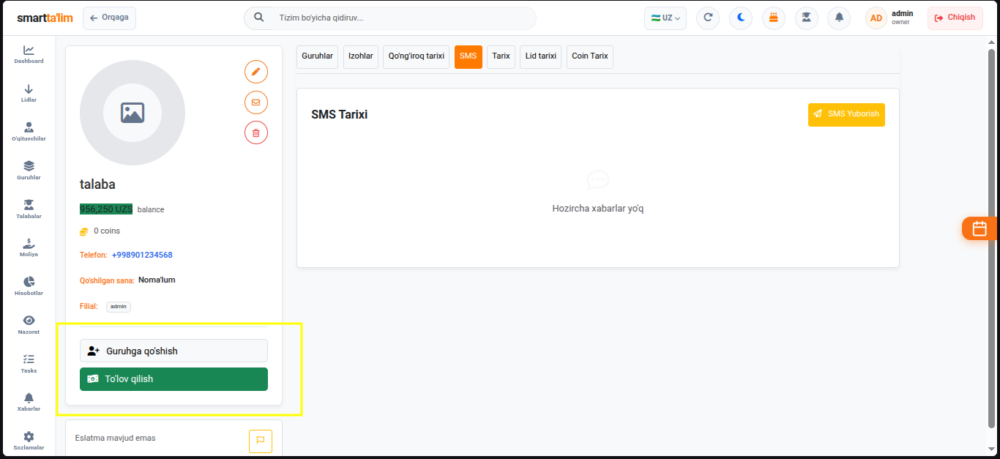
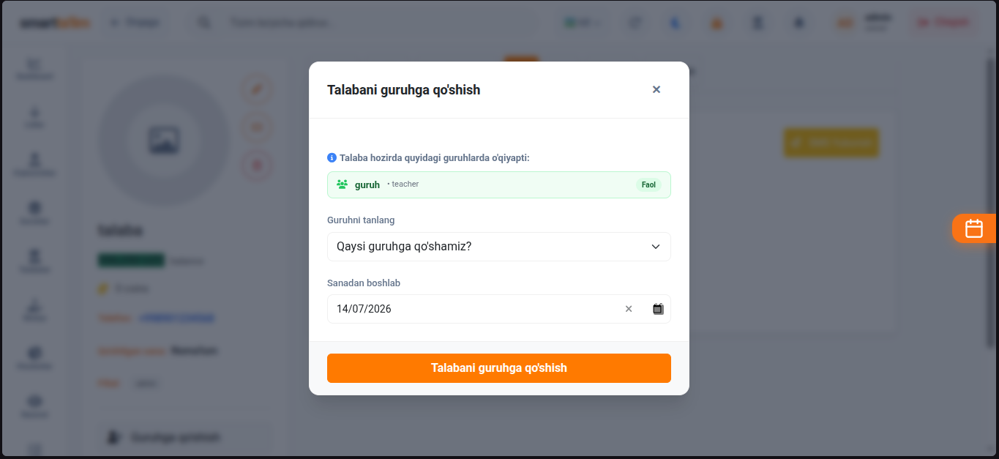
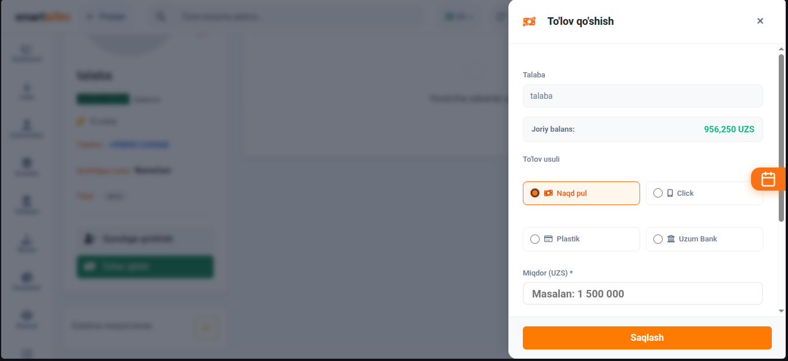
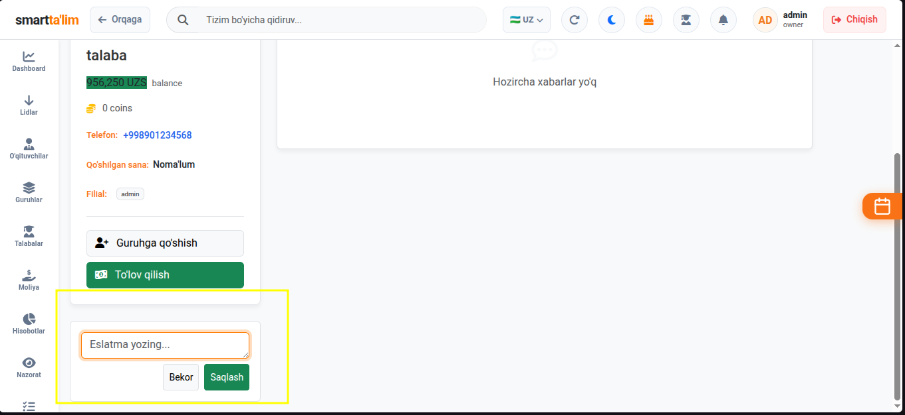

# Talabalar (Students) va Talaba Profili

**Talabalar** bo'limi o'quv markazida tahsil olayotgan barcha o'quvchilar ma'lumotlar bazasini boshqaradi. Bu bo'lim orqali administratorlar talabalar haqidagi ma'lumotlarni saqlaydi, ularning to'lovlarini qabul qiladi va darslardagi davomat tarixini tahlil qiladi.

---

## 1. Talabalar Ro'yxati Sahifasi (Students List)

Ushbu sahifada o'quv markazidagi barcha talabalar jadval shaklida taqdim etiladi.

#### Jadval ustunlari va boshqaruv asboblari:
1. **F.I.SH (Talaba ismi)**: Talabaning ismi-familiyasi. Ism ustiga bosish orqali uning batafsil shaxsiy profiliga o'tasiz.
2. **Telefon raqami**: Talabaning yoki uning ota-onasining aloqa raqami.
3. **Guruhlar**: Talaba qaysi guruhlarda o'qiyotganligi.
4. **Balans**: Talabaning shaxsiy hisobidagi joriy qoldiq summa. Agar balans manfiy bo'lsa (masalan, `-200,000 UZS`), u qizil rangda yoziladi va talabaning qarzdor ekanligini anglatadi. Agar balans musbat bo'lsa (masalan, `150,000 UZS`), u yashil rangda yoziladi.
5. **Holati (Status)**:
   * **Faol (Active)** — O'qishni davom ettirayotgan talabalar.
   * **Muzlatilgan (Frozen)** — Vaqtincha o'qishini to'xtatgan (balansidan pul yechilmaydigan) talabalar.
   * **Ketgan (Left)** — Markazdan butunlay ketgan talabalar.
6. **Saralash va Filtrlar (Filters)**:
   * Guruhlar bo'yicha saralash.
   * Balans bo'yicha saralash (faqat qarzdorlarni yoki faqat musbat balanslarni chiqarish).
   * Status bo'yicha filtrlash.

---

## 2. Yangi talaba qo'shish (Create Student)

Markazga kelgan yangi o'quvchini ro'yxatdan o'tkazish.

#### Yangi talaba qo'shish yo'riqnomasi:
1. Talabalar sahifasining o'ng tepasidagi `Talaba qo'shish` (yashil "+") tugmasini bosing.
2. Formani to'ldiring:
   * **Ismi va Familiyasi**: Talabaning to'liq ma'lumotlari.
   * **Telefon raqami**: O'quvchining shaxsiy telefoni.
   * **Ota-onasining raqami**: Balans kamolganda yoki davomat yuborish uchun aloqa raqami.
   * **Tug'ilgan kuni**: Tug'ilgan kunlarda tabriklash tizimi to'g'ri ishlashi uchun kiriting.
   * **Guruh biriktirish**: Ro'yxatdan o'tish bilan birga uni darhol dars guruhiga qo'shish imkoniyati.
3. `Saqlash` tugmasini bosing. Talaba tizim bazasiga qo'shiladi.

---

## 3. Excel fayli orqali ommaviy import (Excel Import)

Mavjud talabalar ro'yxatini Excel fayli yordamida tizimga ommaviy ravishda yuklash.

* Namunaviy faylni yuklab olib, o'quvchilar ma'lumotlarini (F.I.SH, Telefon, Balans, status) to'ldiring va tizimga yuklang.

---

## 4. Talaba Profili (Student Profile)

Talaba profili — bu talabaning o'quv markazidagi butun hayotiy faoliyatini (loyihalar, guruhlar, to'lovlar, davomatlar va eslatmalar) qamrab oluvchi yagona boshqaruv panelidir.

### Profilning asosiy bo'limlari va funksiyalari:

#### A. Guruhga qo'shish va SMS yuborish
Talaba profilidan turib uni tezkor ravishda yangi dars guruhlariga qo'shish yoki uning raqamiga individual SMS xabar jo'natish mumkin.

* **Guruhga qo'shish** tugmasi bosilganda quyidagi guruh tanlash oynasi ochiladi:
  
  Bu yerdan markazdagi faol guruhlardan birini tanlab, talabani o'sha guruhga biriktirishingiz mumkin.

#### B. To'lov qabul qilish (Payment Modal)
Talaba shaxsiy hisobini to'ldirish uchun to'lov qabul qilish oynasi.

##### To'lov qabul qilish yo'riqnomasi:
1. Profil tepasidagi `To'lov qabul qilish` (yoki ko'k rangli hamyon) tugmasini bosing.
2. Ochilgan oynada:
   * **To'lov usuli (Payment Method)**: Naqd (Cash), Plastik karta (Card) yoki Bank o'tkazmasi (Bank Transfer) usullarini tanlang.
   * **Kassa**: To'lov kirim qilinadigan kassani belgilang (masalan: *Asosiy kassa*, *Click kassa*).
   * **Summa**: Kirim qilinayotgan to'lov miqdorini yozing (masalan: `350,000 UZS`).
   * **Izoh**: To'lov bo'yicha eslatmalar kiriting (masalan: *IELTS iyul oyi uchun*).
3. **Kirim qilish**: `To'lovni saqlash` tugmasini bosing. Talabaning balansi ko'rsatilgan summaga avtomatik ravishda ko'payadi va pul tegishli kassaga kirim bo'ladi. Tizim avtomatik chek shakllantiradi.

#### C. Ichki Eslatmalar yozish (Student Notes)
Administratorlar yoki o'qituvchilar talaba profilida faqat ma'murlar ko'ra oladigan maxsus eslatmalarni yozib qoldiradilar.

* Masalan: *Ota-onasi faqat Telegram orqali bog'lanishni so'radi* yoki *Darslarga doimiy kechikib keladi*.
