# Vazifalar (Tasks - Trello Doskasi)

**Vazifalar (Tasks)** moduli — bu o'quv markazi xodimlari o'rtasida ishlarni taqsimlash, loyihalarni rejalashtirish, topshiriqlar bajarilishini nazorat qilish hamda hamkorlikda ishlash uchun mo'ljallangan ilg'or Kanban/Trello tizimidir.

---

## 1. Doskalar yaratish va boshqarish (Boards Management)

Vazifalar bo'limiga kirilganda foydalanuvchilar har xil loyihalar (masalan: *Marketing kampaniyasi*, *Yangi filial sozlash*, *O'quv rejalari*) uchun alohida doskalar yaratib ishlaydilar.

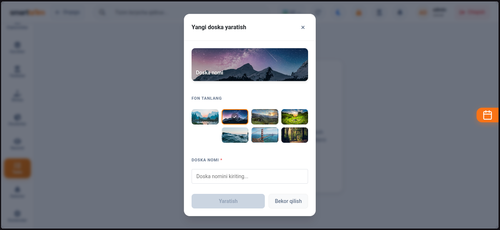
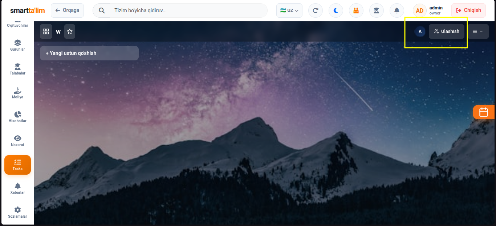

#### Doska yaratish bosqichlari:
1. Sahifadagi `Doska yaratish` (Create Board) tugmasini bosing.
2. Ochilgan oynada doska nomini yozing (masalan: *Marketing*).
3. Doska uchun fon rangi yoki chiroyli rasm/gradient fon tanlang.
4. `Yaratish` tugmasini bosing.

#### Doskaga xodimlarni biriktirish (Add Members to Board):
* Loyiha ustida faqat ruxsat berilgan xodimlar ishlashi uchun doska sarlavhasidagi `A'zolar qo'shish` tugmasi orqali markaz xodimlarini doskaga a'zo qilib qo'shing.
  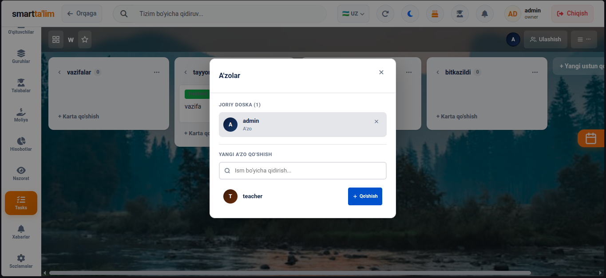

---

## 2. Ustunlar va Vazifalar (Cards) Yaratish

Doska ichida ishlarni bosqichma-bosqich boshqarish uchun ustunlar (Lists) va ularning ichida alohida vazifa kartochkalari (Cards) yaratiladi.

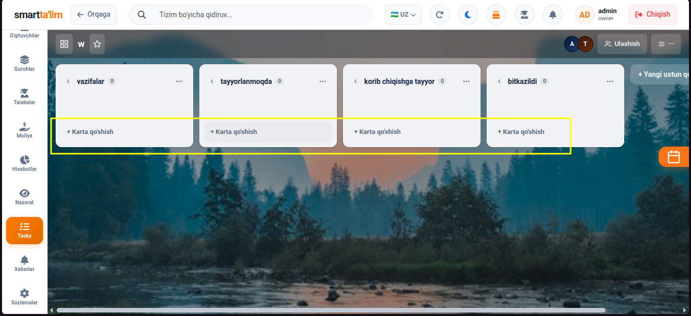

#### Ustun yaratish:
* Loyihangizning dars/ish jarayoniga qarab ustunlar yarating. Odatda: *Reja*, *Bajarilmoqda*, *Tekshiruv*, *Tayyor*.
* Yangi ustun qo'shish uchun doskaning oxiridagi `Ustun qo'shish` tugmasini bosing va nom bering.

#### Karta (Vazifa) yaratish:
* Kerakli ustun ostidagi `Vazifa qo'shish` (Add Card) yoki "+" tugmasini bosing.
* Vazifaning sarlavhasini yozing va `Karta qo'shish` tugmasini bosing.

#### Kartani ko'chirish (Drag & Drop):
* Vazifaning holati o'zgarganda (masalan, vazifani bajarishni boshlasangiz), kartani shunchaki chap tugma bilan bosib turib, uni "Reja" ustunidan "Bajarilmoqda" ustuniga sudrab o'tkazasiz.
  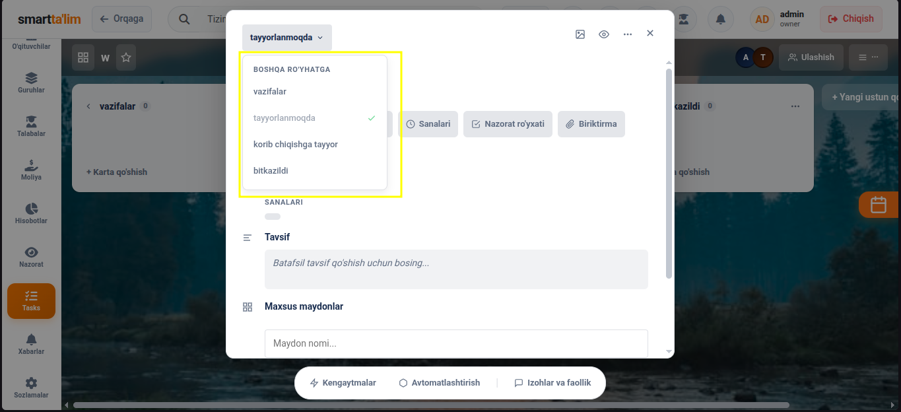

---

## 3. Vazifa kartasi amallari (Card Quick Actions)

Kartaning o'ng tepasidagi uchta nuqta menyusi orqali kartani ochmasdan tezkor tahrirlash, boshqa doskaga ko'chirish, arxivlash yoki o'chirib yuborish amallarini bajarish mumkin.

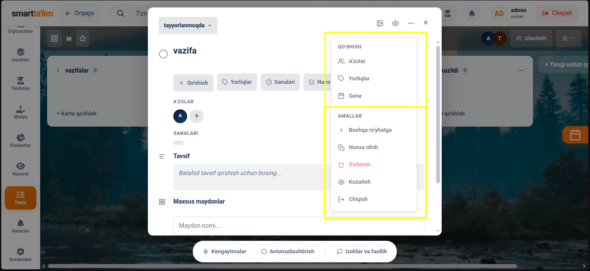

---

## 4. Vazifa Tafsilotlari (Card Details Modal)

Karta ustiga bosganingizda vazifaning barcha sozlamalari, cheklistlari va muhokamalari jamlangan batafsil ekran ochiladi.

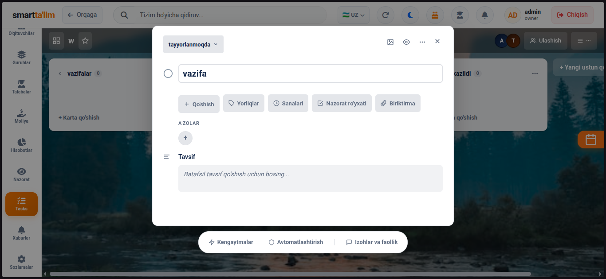

### Karta ichidagi boshqaruv yo'riqnomasi:

#### A. Vazifaga mas'ul a'zolarni belgilash (Members)
Vazifani bajarishi lozim bo'lgan xodimlarni biriktirish oynasi.
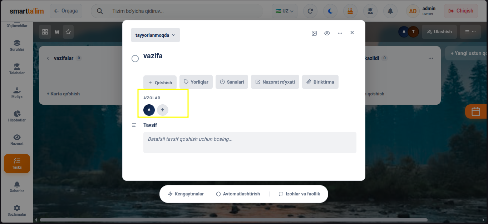
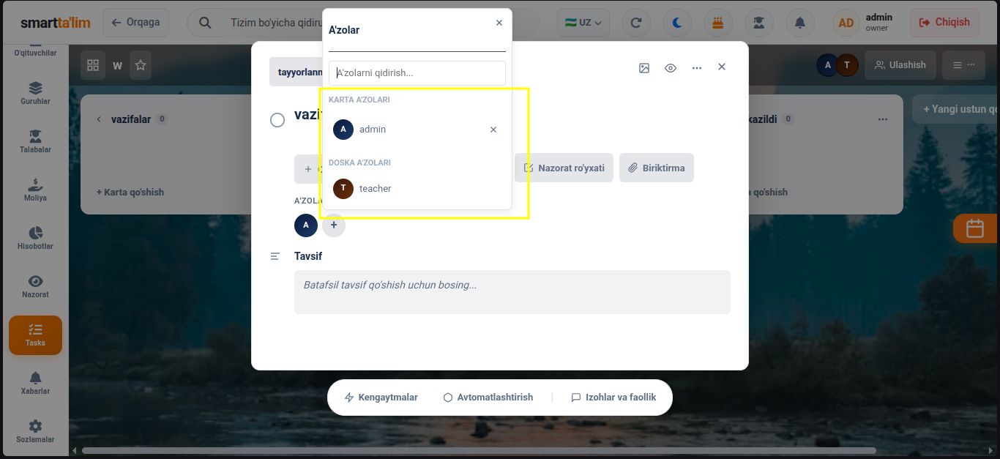

* Karta ichidagi `A'zolar` tugmasini bosing va doska a'zolaridan kerakli xodimlarni belgilang. Ularning avatarlari karta ustida ko'rinadi va ularga bildirishnoma ketadi.

#### B. Yorliqlar qo'shish (Labels)
Vazifalarni ustuvorligi bo'yicha vizual rangli teglar bilan belgilash.
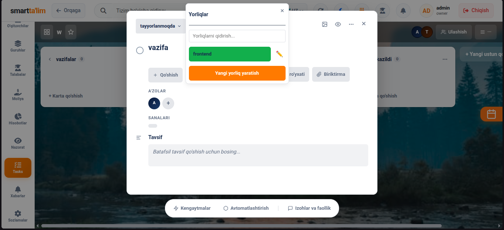

* Masalan: Qizil yorliq — *Shoshilinch*, Yashil yorliq — *Muhim emas*.

#### C. Nazorat Ro'yxati (Checklist)
Vazifaning bajarilishi lozim bo'lgan kichik bosqichlarini yozib chiqish.
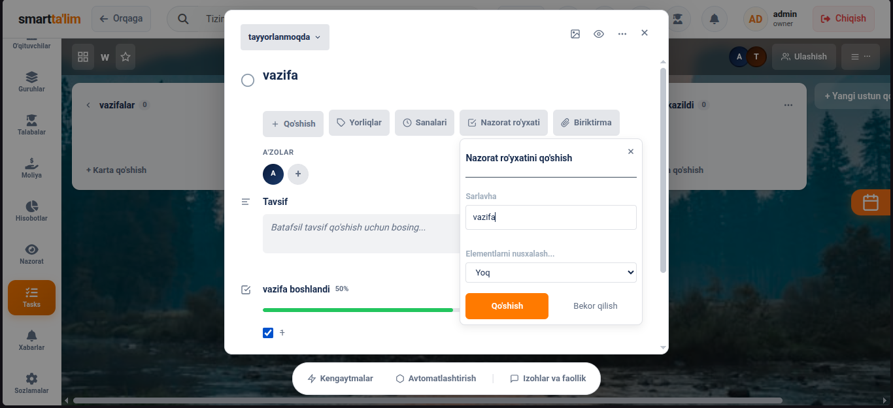
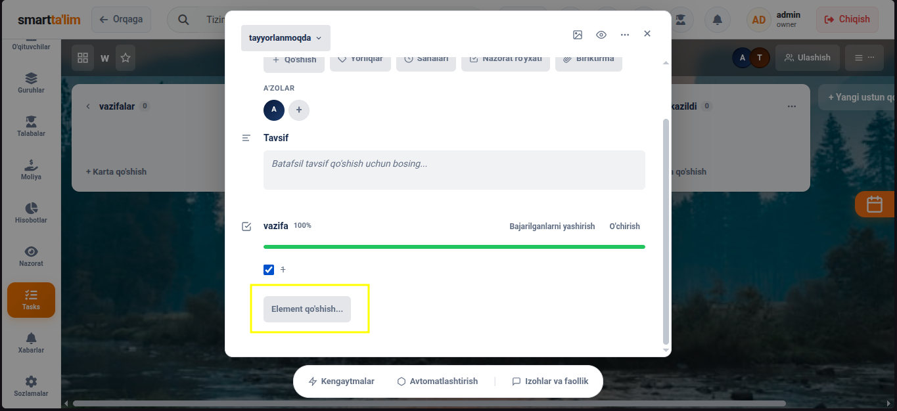

* Cheklist bandlarini qo'shing (masalan: *1. Rasm tayyorlash, 2. Matn yozish*).
* Har bir band bajarilganda cheklist yonidagi katakchani belgilaysiz, tizim bajarilganlik foizini (progress bar) avtomatik hisoblab boradi.

#### D. Muddat o'rnatish (Due Date)
Vazifa topshirilishi kerak bo'lgan muddatni belgilash.
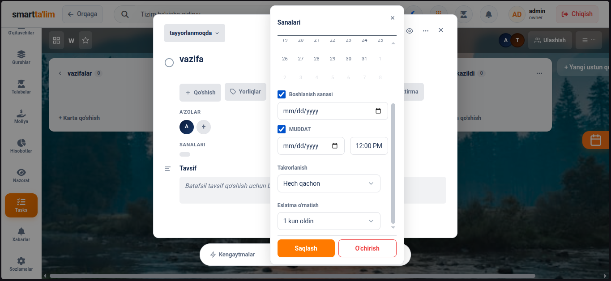

* Sana va soatni tanlab saqlang. Muddat yaqinlashganda (masalan, 24 soat qolganda) mas'ul xodimlarga qizil rangli eslatma belgisi ko'rinadi.

#### E. Izohlar va Muhokama (Comments)
Vazifa yuzasidan xodimlarning o'zaro suhbati va fikrlari.
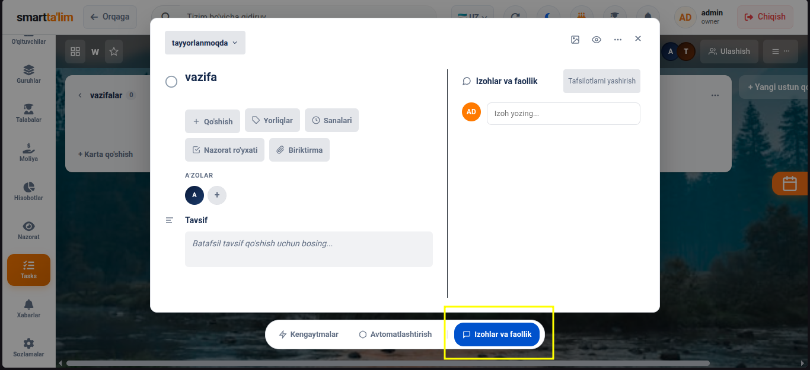

* Xodimlar vazifa bo'yicha savol yoki natijalarni yozib qoldiradilar. Izoh yozganda fayllarni biriktirish ham mumkin.

---

## 5. Maxsus Maydonlar (Custom Fields)

Doskadagi vazifalarga qo'shimcha maxsus xususiyatlar yoki ma'lumot turlarini qo'shish imkonini beruvchi tizim.

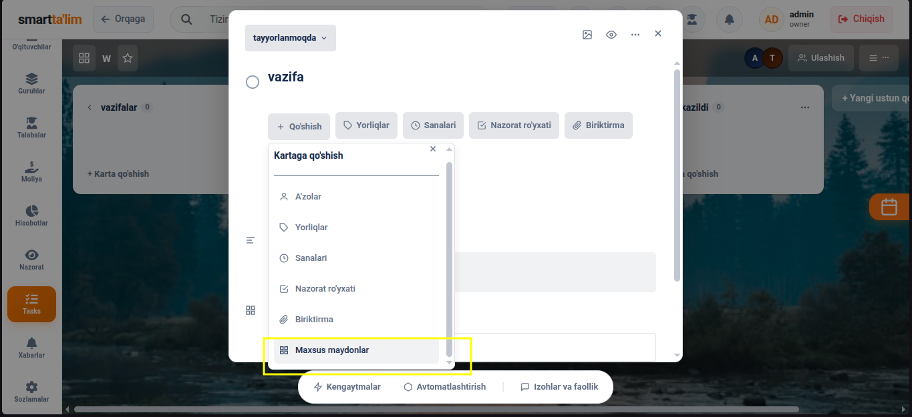
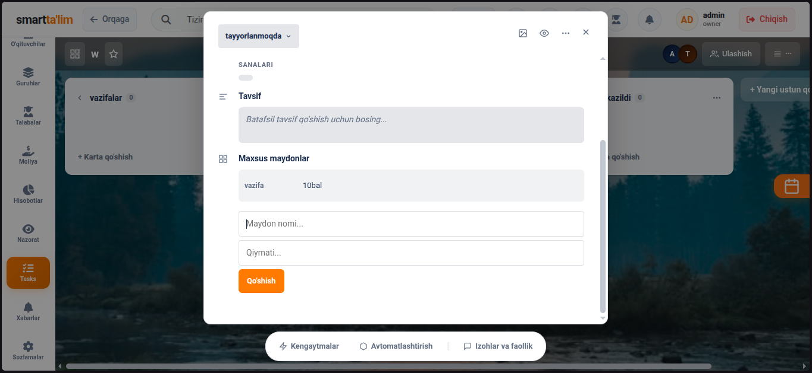

* Agarda vazifalarga qo'shimcha ma'lumot turi kerak bo'lsa (masalan: *Narxi*, *Mijoz telefoni*, *Smeta havolasi*), shu yerdan yangi maxsus maydon (Custom Field) yaratib, qiymatini kiritib qo'yishingiz mumkin.
